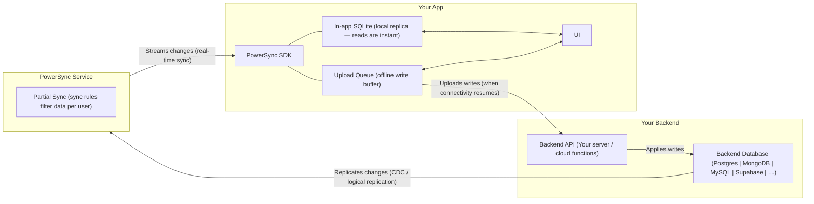

# PowerSync Skills

Use this skill to onboard a project onto PowerSync without trial-and-error. Treat this as a guided workflow first and a reference library second.

## Agent compliance (read first — non-negotiable)

**Follow this file’s playbook in order.** Do not skip ahead, assume defaults, or substitute your own architecture to “save time.”

| Do | Don’t |
|----|--------|
| Ask for **Cloud vs self-hosted** and **which backend** if the user did not say | Assume Supabase, assume Postgres, or pick self-hosted Docker without asking |
| Use the **PowerSync CLI** to scaffold, link (if cloud hosted), and deploy (`references/powersync-cli.md`) | Hand-write `service.yaml` / `sync-config.yaml` from scratch or invent compose files **unless** the user explicitly says they cannot use the CLI |
| **Stop and ask** when a step needs credentials or interactive Cloud login you cannot perform | Silently build an alternate stack (e.g. manual Docker) without user confirmation |
| Complete **backend readiness** (deployed sync config, auth, publication) **before** app code | Start React/client integration while sync is still unconfigured |

If the user wants a shortcut, they must **say so explicitly** (e.g. “I can’t use the CLI, give dashboard steps only”).

## Always Use the PowerSync CLI

**The [PowerSync CLI](https://docs.powersync.com/tools/cli.md) is the default tool for all PowerSync operations.** Do not manually create config files, do not direct users to the dashboard, and do not write service.yaml or sync-config.yaml from scratch. The CLI handles all of this.

What the CLI does — use it instead of doing these things manually:

- **Create a Cloud instance:** `powersync init cloud` → `powersync link cloud --create --project-id=<id>` (scaffolds config, creates the instance, and links it in one flow)
- **Link an existing Cloud instance:** `powersync pull instance --project-id=<id> --instance-id=<id>` (downloads config to local files)
- **Create a local self-hosted instance:** `powersync init self-hosted` → `powersync docker configure` → `powersync docker start` (spins up a full local PowerSync stack via Docker — no manual Docker setup needed)
- **Deploy config:** `powersync deploy service-config`, `powersync deploy sync-config` (validates and deploys — don't copy-paste YAML to a dashboard)
- **Generate client schema:** `powersync generate schema --output=ts` (generates TypeScript schema from deployed sync config — don't write it by hand)
- **Generate dev tokens:** `powersync generate token --subject=user-1` (for local testing — don't hardcode JWTs)

Only fall back to manual config or dashboard instructions when the user explicitly says they can't use the CLI.

Full CLI reference: `references/powersync-cli.md` — **always load this file** when setting up or modifying a PowerSync instance.

## Onboarding Playbook

When the task is to add PowerSync to an app, follow this sequence in order:

1. Identify the platform: **Cloud** or **self-hosted**.
2. **Identify the backend.** If the user has not specified a backend, **ask them** which database/backend they want to use (e.g. Supabase, custom Postgres, MongoDB, MySQL, MSSQL). Do not assume Supabase. The choice determines which references to load:
   - **Supabase** → load `references/onboarding-supabase.md`
   - **Any other backend** → load `references/onboarding-custom.md` — the agent must create a backend API with `uploadData`, token, and JWKS endpoints. Do not skip this.
3. If the backend is Supabase and it is unclear whether the user means **online (Supabase Cloud)** or **locally hosted** (e.g. `supabase start`), **ask the user** before choosing connection strings, auth config, or references.
4. Collect required inputs before coding.
5. **Always load `references/sync-config.md`** and generate sync config. For source database setup (publication SQL, replication, CDC), see `references/powersync-service.md` § "Source Database Setup". Sync config is mandatory for every PowerSync project — without it, nothing syncs.
6. **Persist all credentials and connection details to `.env` immediately.** When a CLI or dashboard provides database credentials (host, port, database name, username, password, connection URI), write them to the project's `.env` file right away — before deploying config or writing app code. Both `service.yaml` (via `!env` tags) and app code (e.g. `fetchCredentials`) depend on these values. If they are not in `.env`, the PowerSync config will deploy with broken connection details and the app will not connect. Include at minimum: `POWERSYNC_URL`, the Postgres connection URI (e.g. `PS_DATABASE_URI`), and any backend-specific keys.
7. **Create/link the instance and deploy config before writing app code.** Use the CLI — do not create config files manually. For Cloud: `powersync init cloud` → edit config → `powersync link cloud --create` → `powersync deploy`. For self-hosted: `powersync init self-hosted` → `powersync docker configure` → `powersync docker start`. For source database setup the agent cannot run (e.g. Supabase publication SQL), present the exact SQL and ask the user to confirm it is done. The app will not sync without deployed config.
8. Only after backend readiness is confirmed, implement app-side PowerSync integration.

Do not start client-side debugging while the PowerSync service is still unconfigured. If the UI is stuck on `Syncing...`, the default diagnosis is incomplete backend setup, not a frontend bug.

## Critical Footguns

These apply to all paths. Domain-specific pitfalls are documented in the relevant reference files — only load those when working on that domain.

- After any CLI operation that provisions or links a service (Supabase, PowerSync, or any backend), immediately write the resulting credentials and URLs to the project `.env` file. Do not defer this — downstream config and app code read from `.env` and will break silently if values are missing.
- `powersync pull instance` silently overwrites local `service.yaml` and `sync-config.yaml`. Always back up before pulling.

Additional footguns are in their reference files — do not load these unless working in that area:
- **Config/CLI:** `references/powersync-cli.md`, `references/powersync-service.md`, `references/sync-config.md`
- **JS/TS SDK:** `references/sdks/powersync-js.md` (type-only imports, connect() semantics, transaction.complete())
- **React:** `references/sdks/powersync-js-react.md` (Strict Mode, Suspense, Next.js)
- **Supabase:** `references/supabase-auth.md` (JWT signing keys, publication SQL, local Supabase)
- **Custom backend:** `references/custom-backend.md` (upload endpoint rules, JWT pitfalls)

## Required Inputs Before Coding

Collect the minimum required information for the chosen path before changing app code.

### All paths

- Which backend/database (do not assume Supabase — ask if not specified)
- Whether the PowerSync instance already exists
- PowerSync instance URL, if an instance already exists
- Project ID and instance ID, if using CLI with an existing instance
- Source database connection string, if PowerSync still needs the source DB connection

### Additional for Supabase

- **Whether Supabase is online (hosted at supabase.com) or locally hosted** (e.g. `supabase start`) — if you cannot infer this from the project or env, **prompt the user**
- Whether Supabase JWT signing uses new signing keys or legacy JWT secret, if not obvious from the setup

### Additional for custom backends

- How the user wants to handle auth (custom JWT, third-party auth provider)
- Whether they have an existing backend API or need to create one (load `references/custom-backend.md`)

Only ask for secrets when you are at the step that actually needs them.

## Cloud Readiness Gate

Do not proceed to app-side code until all items below are verified:

- PowerSync instance exists
- Source database connection is configured
- Sync config is deployed
- Client auth is configured
- Instance URL is available for `fetchCredentials()`
- Source database replication/publication setup is complete
- All credentials and URLs are persisted in `.env` (e.g. `POWERSYNC_URL`, `PS_DATABASE_URI`, and any backend-specific keys)

If any item is missing, finish the service setup first.

Use the CLI to verify and complete any missing items. For steps the agent cannot perform (e.g. running SQL in the database), present the exact commands and ask the user to confirm completion before writing app code.

## First Response for `Syncing...`

Follow `references/powersync-debug.md` § "First Response When the UI Is Stuck on `Syncing...`" — verify backend readiness (endpoint URL, DB connection, sync config, client auth, replication/publication) before inspecting frontend code or requesting console logs.

## Setup Paths

Choose the matching path after the preflight. The CLI is the default for all paths.

### Path 1: Cloud + CLI (Recommended)

Load `references/powersync-cli.md` and prefer the CLI for every step it supports:

- Create and link the instance: `powersync link cloud --create --project-id=<project-id>`
- Deploy service config: `powersync deploy service-config`
- Deploy sync config: `powersync deploy sync-config`
- Prefer `PS_ADMIN_TOKEN` in autonomous or noninteractive environments; use **`powersync login` only for Cloud** (stores a Cloud PAT), and only when interactive auth is acceptable

### Path 2: Cloud + Dashboard

Only use this path if the user explicitly prefers the dashboard or the CLI is unavailable.

Guide the user through the dashboard sequence:

1. Create or open the PowerSync project and instance.
2. Connect the source database.
3. Deploy sync config.
4. Configure client auth.
5. Copy the instance URL.
6. Verify source database replication/publication setup.

If the backend is Supabase, also load `references/supabase-auth.md`.

### Path 3: Self-Hosted + CLI (Recommended)

**Not Cloud:** do not use **`powersync login`** as the way to “log in” to self-hosted — that command stores a **PowerSync Cloud** PAT. Self-hosted uses **`powersync init self-hosted`**, **`powersync docker configure`**, **`powersync docker start`**, and the service’s **`PS_ADMIN_TOKEN`** for admin API access.

Load `references/powersync-cli.md`, `references/powersync-service.md`, and `references/sync-config.md`. Prefer the CLI for Docker runs (`powersync docker run`, `powersync docker reset`), schema generation, and any supported self-hosted operations. See [PowerSync CLI](https://docs.powersync.com/tools/cli.md).

### Path 4: Self-Hosted + Manual Docker

Only when the CLI cannot be used. Load `references/powersync-service.md` and `references/sync-config.md`. If the backend is **not** Supabase, also load `references/custom-backend.md`.

## Architecture

Key rule: **client writes never go through PowerSync**. They go from the app's upload queue to your backend API. PowerSync handles the read and sync path only.

## What to Load for Your Task

| Task | Start with | Load on demand |
|------|-----------|----------------|
| Supabase + PowerSync | `references/onboarding-supabase.md` | `references/supabase-auth.md`, `references/sync-config.md`, SDK files (when writing app code) |
| Custom backend (non-Supabase) | `references/onboarding-custom.md` | `references/custom-backend.md`, `references/sync-config.md`, SDK files (when writing app code) |
| New project setup | `references/powersync-cli.md` + `references/powersync-service.md` | `references/sync-config.md`, SDK files (when writing app code) |
| Self-hosting / service config | `references/powersync-service.md` + `references/powersync-cli.md` | `references/sync-config.md` |
| Writing sync config | `references/sync-config.md` | — |
| Debugging sync issues | `references/powersync-debug.md` | — |
| Attachments | `references/attachments.md` | — |
| Architecture overview | This file is sufficient | `references/powersync-overview.md` for deep links |

## SDK Reference Files

### JavaScript / TypeScript

Always load `references/sdks/powersync-js.md` for any JS/TS project, then load the applicable framework file.

| Framework | Load when… | File |
|-----------|-----------|------|
| React / Next.js | React web app, Next.js, or **any Vite + React project** (load before package install — contains required `vite.config.ts` with `optimizeDeps.exclude` and `worker.format: 'es'`) | `references/sdks/powersync-js-react.md` |
| React Native / Expo | React Native, Expo, or Expo Go | `references/sdks/powersync-js-react-native.md` |
| Vue / Nuxt | Vue or Nuxt | `references/sdks/powersync-js-vue.md` |
| Node.js / Electron | Node.js CLI/server or Electron | `references/sdks/powersync-js-node.md` |
| TanStack | TanStack Query or TanStack DB | `references/sdks/powersync-js-tanstack.md` |

### Other SDKs

| Platform | Load when… | File |
|----------|-----------|------|
| Dart / Flutter | Dart / Flutter | `references/sdks/powersync-dart.md` |
| .NET | .NET | `references/sdks/powersync-dotnet.md` |
| Kotlin | Kotlin | `references/sdks/powersync-kotlin.md` |
| Swift | Swift / iOS / macOS | `references/sdks/powersync-swift.md` |

## Key Rules to Apply Without Being Asked

- Use Sync Streams for new projects. Sync Rules are legacy.
- Never define the `id` column in a PowerSync table schema; it is created automatically.
- Use `column.integer` for booleans and `column.text` for ISO date strings.
- `connect()` is fire-and-forget. Use `waitForFirstSync()` if you need readiness.
- `transaction.complete()` is mandatory or the upload queue stalls permanently.
- `disconnectAndClear()` is required on logout or user switch when local data must be wiped.
- A 4xx response from `uploadData` blocks the upload queue permanently; return 2xx for validation errors.
