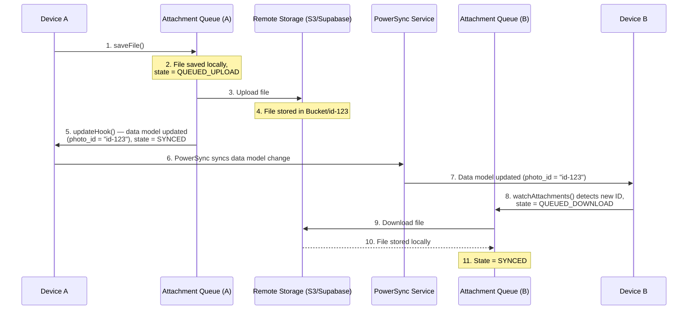

# PowerSync Attachments

PowerSync handles file attachments using a **metadata + storage provider** pattern: structured metadata syncs through PowerSync while actual files live in a purpose-built storage system (S3, Supabase Storage, Cloudflare R2, etc.). An offline-first queue manages uploads, downloads, and retries automatically in the background.

| Resource | Description |
|----------|-------------|
| [Attachments docs](https://docs.powersync.com/client-sdks/advanced/attachments.md) | Full reference including migration notes and platform demos |

> **Deprecated packages:** `@powersync/attachments` (JS/TS) and `powersync_attachments_helper` (Dart/Flutter) are deprecated. Attachment functionality is now built in to the platform SDK packages. Do not install the old packages for new projects.

## How It Works



1. App calls `saveFile()` — file is written to local storage immediately, a record is inserted into the local attachments table with state `QUEUED_UPLOAD`, and the `updateHook` links the attachment ID to your data model in the same transaction.
2. The attachment queue uploads the file to remote storage in the background.
3. On upload success, the record transitions to `SYNCED`.
4. PowerSync syncs the data model change (e.g. `user.photo_id`) to other devices.
5. Those devices' `watchAttachments` query detects the new ID, creates a `QUEUED_DOWNLOAD` record, and the queue downloads the file automatically.

### Attachment States

| State | Meaning |
|-------|---------|
| `QUEUED_UPLOAD` | Saved locally, waiting to upload |
| `QUEUED_DOWNLOAD` | ID received from sync, file not yet downloaded |
| `SYNCED` | File exists locally and in remote storage |
| `QUEUED_DELETE` | Marked for deletion from both local and remote |
| `ARCHIVED` | No longer referenced in data model; candidate for cleanup |

## Package Setup

**Web / Node.js** — built in, no separate install:
```bash
# Already included in @powersync/web and @powersync/node
```

**React Native** — built in to `@powersync/react-native`, but local storage adapter requires a separate package:
```bash
# Expo (requires Expo 54+)
npx expo install @powersync/attachments-storage-react-native expo-file-system

# Bare React Native
npm install @powersync/attachments-storage-react-native @dr.pogodin/react-native-fs
```

**Flutter/Dart, Kotlin, Swift** — built in to the respective SDK, no additional package needed.

## Schema Setup

Add `AttachmentTable` as a local-only table alongside your regular tables. It is not synced through PowerSync — it is managed entirely by the attachment queue on each device.

**JavaScript / TypeScript:**
```ts
import { Schema, Table, column, AttachmentTable } from '@powersync/web';
// or from '@powersync/react-native' / '@powersync/node'

export const AppSchema = new Schema({
  users: new Table({
    name: column.text,
    photo_id: column.text,  // FK referencing attachment ID
  }),
  attachments: new AttachmentTable(),  // local-only, managed by queue
});
```

`AttachmentTable` accepts an optional `viewName` (default: `'attachments'`). Use a custom `viewName` when migrating from the old `@powersync/attachments` package to avoid a SQLite name conflict with the legacy table.

**Dart:**
```dart
import 'package:powersync/powersync.dart';
import 'package:powersync_core/attachments/attachments.dart';

final schema = Schema([
  Table('users', [Column.text('name'), Column.text('photo_id')]),
  AttachmentsQueueTable(),
]);
```

**Kotlin / Swift** — use `createAttachmentsTable("attachments")` / `createAttachmentTable(name: "attachments")` respectively. See [SDK demos](https://docs.powersync.com/client-sdks/advanced/attachments.md#sdk--demo-reference) for full examples.

## Storage Adapters

The attachment queue requires two adapters:

- **`localStorage`** — reads/writes files on the local device
- **`remoteStorage`** — uploads/downloads files to/from cloud storage

### Local Storage Adapters (JS/TS)

```ts
// Web (IndexedDB)
import { IndexDBFileSystemStorageAdapter } from '@powersync/web';
const localStorage = new IndexDBFileSystemStorageAdapter('my-app-files');

// Node.js / Electron
import { NodeFileSystemAdapter } from '@powersync/node';
const localStorage = new NodeFileSystemAdapter('./user-attachments');

// React Native — Expo (Expo 54+)
import { ExpoFileSystemStorageAdapter } from '@powersync/attachments-storage-react-native';
const localStorage = new ExpoFileSystemStorageAdapter();

// React Native — bare
import { ReactNativeFileSystemStorageAdapter } from '@powersync/attachments-storage-react-native';
const localStorage = new ReactNativeFileSystemStorageAdapter();
```

### Remote Storage Adapter

Implement an object with `uploadFile`, `downloadFile`, and `deleteFile`. Always use signed URLs generated by your backend — never expose storage credentials to the client.

```ts
import type { AttachmentRecord } from '@powersync/web';

const remoteStorage = {
  async uploadFile(fileData: ArrayBuffer, attachment: AttachmentRecord) {
    const { uploadUrl } = await fetch('/api/attachments/upload-url', {
      method: 'POST',
      headers: { 'Content-Type': 'application/json' },
      body: JSON.stringify({ filename: attachment.filename, contentType: attachment.mediaType }),
    }).then(r => r.json());

    await fetch(uploadUrl, {
      method: 'PUT',
      body: fileData,
      headers: { 'Content-Type': attachment.mediaType ?? 'application/octet-stream' },
    });
  },

  async downloadFile(attachment: AttachmentRecord): Promise<ArrayBuffer> {
    const { downloadUrl } = await fetch(`/api/attachments/${attachment.id}/download-url`).then(r => r.json());
    return fetch(downloadUrl).then(r => r.arrayBuffer());
  },

  async deleteFile(attachment: AttachmentRecord) {
    await fetch(`/api/attachments/${attachment.id}`, { method: 'DELETE' });
  },
};
```

## Initialize the Attachment Queue

```ts
import { AttachmentQueue } from '@powersync/web';
// or '@powersync/react-native' / '@powersync/node'

const attachmentQueue = new AttachmentQueue({
  db,           // PowerSyncDatabase instance
  localStorage,
  remoteStorage,

  // Tell the queue which attachments your data model references.
  // Called reactively whenever watched tables change.
  watchAttachments: (onUpdate) => {
    db.watch(
      `SELECT photo_id FROM users WHERE photo_id IS NOT NULL`,
      [],
      {
        onResult: async (result) => {
          const attachments = result.rows?._array.map(row => ({
            id: row.photo_id,
            fileExtension: 'jpg',
          })) ?? [];
          await onUpdate(attachments);
        },
      }
    );
  },

  syncIntervalMs: 30_000,       // retry interval (default: 30s)
  downloadAttachments: true,    // auto-download referenced files (default: true)
  archivedCacheLimit: 100,      // archived files to keep before cleanup (default: 100)
});

await attachmentQueue.startSync();
```

`watchAttachments` is critical: it tells the queue which files the app needs based on the current data model. The queue uses its output to decide what to download, upload, or archive. Each item must include `id` and `fileExtension`.

## Upload a File

Use `saveFile()`. The `updateHook` runs in the same database transaction as the attachment record creation, ensuring the FK in your data model and the attachment record are always written atomically.

```ts
async function uploadProfilePhoto(imageBlob: Blob, userId: string) {
  const arrayBuffer = await imageBlob.arrayBuffer();

  await attachmentQueue.saveFile({
    data: arrayBuffer,
    fileExtension: 'jpg',
    mediaType: 'image/jpeg',
    updateHook: async (tx, attachment) => {
      // Runs in the same transaction — atomic
      await tx.execute('UPDATE users SET photo_id = ? WHERE id = ?', [attachment.id, userId]);
    },
  });
}
```

> **Do not write the FK separately** outside of `updateHook`. Writing it in a separate `db.execute()` call after `saveFile()` breaks atomicity and can leave the data model inconsistent if the app crashes between the two writes.

## Delete a File

**Explicit delete** — use `deleteFile()` with an `updateHook` to clear the FK atomically:

```ts
await attachmentQueue.deleteFile({
  id: photoId,
  updateHook: async (tx, attachment) => {
    await tx.execute('UPDATE users SET photo_id = NULL WHERE id = ?', [userId]);
  },
});
// Queue will: delete from remote storage → delete local file → remove attachment record
```

**Passive archive** — remove the FK reference from your data model without calling `deleteFile()`. The `watchAttachments` query will no longer return the ID, so the queue automatically transitions the record to `ARCHIVED`. Once `archivedCacheLimit` is reached, archived files are deleted in order.

```ts
// Just clear the reference; the queue handles cleanup
await db.execute('UPDATE users SET photo_id = NULL WHERE id = ?', [userId]);
```

## Accessing a File

Files are only available after the attachment record reaches `SYNCED` state. Read `local_uri` from the attachments table:

```ts
// React hook example — watches for the file to become available
function useProfilePhoto(userId: string) {
  return useQuery<{ local_uri: string; state: string }>(
    `SELECT a.local_uri, a.state
     FROM users u
     LEFT JOIN attachments a ON a.id = u.photo_id
     WHERE u.id = ?`,
    [userId]
  );
}

// In your component:
const { data } = useProfilePhoto(userId);
const uri = data?.[0]?.state === 'SYNCED' ? data[0].local_uri : null;
```

For non-React targets, use `db.watch()` with the same query pattern.

## Watching Multiple Attachment Types

**Single queue with `UNION ALL`** — simpler, but the query runs whenever any watched table changes:

```ts
watchAttachments: (onUpdate) => {
  db.watch(
    `SELECT photo_id AS id, 'jpg' AS file_extension FROM users WHERE photo_id IS NOT NULL
     UNION ALL
     SELECT document_id AS id, 'pdf' AS file_extension FROM documents WHERE document_id IS NOT NULL`,
    [],
    {
      onResult: async (result) => {
        const attachments = result.rows?._array.map(row => ({
          id: row.id,
          fileExtension: row.file_extension,
        })) ?? [];
        await onUpdate(attachments);
      },
    }
  );
},
```

**Multiple queues** — each queue watches its own table with a simpler query; more memory, but independent configuration per attachment type.

## Error Handling

Return `true` to retry on the next sync interval; return `false` to archive the attachment and stop retrying.

```ts
import type { AttachmentErrorHandler } from '@powersync/web';

const errorHandler: AttachmentErrorHandler = {
  async onDownloadError(attachment, error) {
    if (error.message.includes('404')) return false; // file gone — don't retry
    return true;
  },
  async onUploadError(attachment, error) {
    return true; // always retry uploads
  },
  async onDeleteError(attachment, error) {
    return true;
  },
};

const attachmentQueue = new AttachmentQueue({ /* ... */ errorHandler });
```

## Key Rules to Apply Without Being Asked

- **`updateHook` is mandatory for atomicity** — always link the attachment ID to your data model inside `updateHook`, never in a separate write after `saveFile()`.
- **Signed URLs only** — the remote storage adapter must fetch signed URLs from your backend. Never embed storage credentials in the client app.
- **React Native needs a separate local storage package** — install `@powersync/attachments-storage-react-native` and the appropriate file system peer (`expo-file-system` for Expo 54+, `@dr.pogodin/react-native-fs` for bare RN).
- **`fileExtension` is required in `watchAttachments`** — each item returned by `watchAttachments` must include both `id` and `fileExtension`; the queue uses the extension to name local files.
- **Check `state === 'SYNCED'` before using `local_uri`** — the record exists before the file is downloaded; accessing `local_uri` when state is `QUEUED_DOWNLOAD` will point to a file that doesn't exist yet.
- **Migration from `@powersync/attachments`** — set a custom `viewName` on `AttachmentTable` (e.g. `'attachment_queue'`) to avoid a SQLite conflict with the legacy `attachments` table. Also update: `syncInterval` → `syncIntervalMs`, `cacheLimit` → `archivedCacheLimit`, `name` → `viewName` on `AttachmentTable`.
