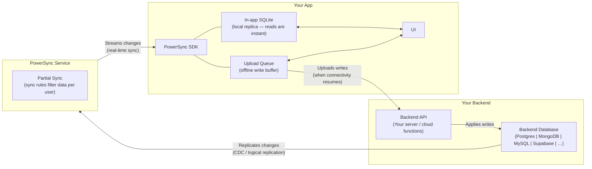

# PowerSync Architecture Overview

Guidance for understanding all the moving components of PowerSync. For information about the vision of PowerSync, see [PowerSync Philosophy](https://docs.powersync.com/intro/powersync-philosophy.md)

## Architecture

See [Architecture Overview](https://docs.powersync.com/architecture/architecture-overview.md) for more details on the overall architecture

The list below lists each component, what it is and where to find detailed information about each of them.

| Component            | Description                                                                                                             | Reference                                                                                                         |
|----------------------|-------------------------------------------------------------------------------------------------------------------------|-------------------------------------------------------------------------------------------------------------------|
| PowerSync Service| The server-side component of the sync engine responsible for the read path from the source database to client-side SQLite databases. | [PowerSync Service](https://docs.powersync.com/architecture/powersync-service.md)                                 |
| PowerSync Client | The PowerSync Client SDK embedded into an application.                                                                  | [Client Architecture](https://docs.powersync.com/architecture/client-architecture.md)                             |
| Protocol         | The Protocol used between PowerSync client applications and the PowerSync Service.                                      | [Protocol](https://docs.powersync.com/architecture/powersync-protocol.md)                                                                                                               |
| Consistency      | The checkpoint based system that ensures data is consistent.                                                            | [Consistency](https://docs.powersync.com/architecture/consistency.md)                                                |