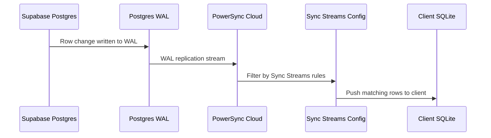
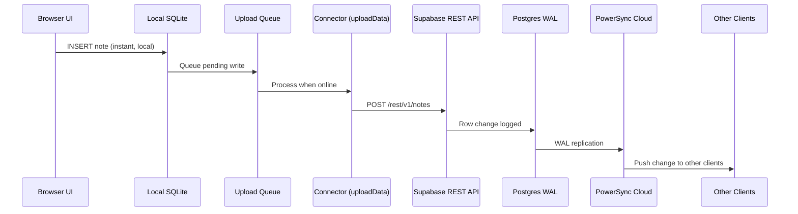

# Offline-First with PowerSync

> **Tutorial**: [Offline-First Demo](../tutorials/offline-first.md) |
> **Setup**: [How to Set Up the PowerSync Demo](../how-to/setup-offline-first.md)

## What Changed and Why

The first two demos (`online-first-demo.html` and `online-sync-demo.html`) talk directly to Supabase. Every read and write requires a network connection. With Wi-Fi off, the apps are completely non-functional -- no data loads, no notes can be saved.

The PowerSync demo inverts this model. The app reads from and writes to a **local SQLite database** in the browser. PowerSync syncs that local database with Supabase in the background, when connectivity is available.

This is the core idea behind **offline-first** (also called **local-first**): the app works without a network connection, and sync happens opportunistically.

---

## Why a Bundler Is Needed

The online-first demos are single HTML files that load the Supabase client from a CDN `<script>` tag. PowerSync's Web SDK cannot work this way. It requires:

| Requirement | Why |
|-------------|-----|
| **WASM (WebAssembly)** | SQLite runs as a compiled WASM binary inside the browser. WASM files need correct MIME headers and proper loading by the JS runtime. |
| **Web Workers** | Database operations run in a background thread so they don't block the UI. Workers are separate JS files loaded on demand. |
| **ES Modules with dynamic imports** | PowerSync uses `import()`  to load workers and WASM at runtime. A plain `<script>` tag cannot resolve these -- a module-aware bundler is required. |

The project uses [Vite](https://vite.dev) as the build tool -- fast, minimal, and ES Module-native.

---

## Vite Configuration

Two settings in `vite.config.js` are specific to PowerSync: `optimizeDeps.exclude` (prevents Vite from pre-bundling packages with WASM and Web Workers) and `worker.format: 'es'` (serves workers as ES modules, which PowerSync requires). See [Vite Configuration](../reference/powersync-config.md#vite-configuration-viteconfigjs) for the full config and explanation of each setting.

---

## The Client Schema

PowerSync uses a client-side schema to define tables in the local SQLite database. Two details distinguish this from the Supabase schema:

1. **No `id` column** -- PowerSync automatically creates a UUID `id` column on every table. You don't declare it but can read and write it in queries.
2. **Three column types only** -- `column.text`, `column.integer`, `column.real`. Timestamps are stored as text (ISO 8601 strings).

See [Client Schema](../reference/powersync-config.md#client-schema-schemajs) for the full schema definition and column type reference.

---

## The Three-Schema Problem

There are three schema definitions in this architecture, and they are **not automatically synchronized**:

| Schema | Where It Lives | What It Defines | Format |
|--------|---------------|-----------------|--------|
| **Supabase Postgres** | SQL migrations | Source-of-truth table structure | `CREATE TABLE notes (id uuid, content text, created_at timestamptz)` |
| **Sync Streams** | PowerSync Dashboard (YAML) | Which columns and rows to replicate | `SELECT * FROM notes` |
| **Client SQLite** | `schema.js` in app code | Local table structure PowerSync creates in the browser | `new Table({ content: column.text, created_at: column.text })` |

When you add a column to Supabase, all three must be updated:

1. **Supabase** -- Add via SQL migration
2. **Sync Streams** -- `SELECT *` picks it up automatically; explicit column lists require manual update
3. **Client schema** -- Add the column to the Table definition in `schema.js`. Without this, synced data for that column is silently dropped.

Missing step 3 is the most common integration error. The PowerSync Dashboard has a **Client SDK Setup** page that generates the client schema from your deployed Sync Streams config -- a one-time generation tool, not a live sync.

---

## How Sync Works

### Download path: Supabase to client

PowerSync reads the Postgres WAL (Write-Ahead Log) to detect changes, filters them through Sync Streams configuration, and pushes matching rows to connected clients.

### Upload path: client to Supabase

Local writes go into an upload queue. The connector processes the queue and sends operations to Supabase via its REST API.

### Why a dedicated replication role

PowerSync needs `REPLICATION` privilege to read the WAL. The built-in Supabase roles don't have this. A separate `powersync_role` with only `SELECT` + `REPLICATION` follows the principle of least privilege.

### Why a publication

The WAL contains changes for every table. A Postgres publication acts as a filter: only replicate changes to specific tables. Using `FOR TABLE public.notes` instead of `FOR ALL TABLES` keeps it targeted.

---

## The Connector

The connector (`connector.js`) is a class with two methods that PowerSync calls automatically:

### `fetchCredentials()`

Returns the PowerSync Cloud URL and an authentication token. Called every few minutes to keep the connection alive. In production, this would call Supabase Auth for a fresh JWT.

### `uploadData(database)`

Processes the local upload queue. For each pending operation, it translates the PowerSync CRUD operation (`PUT`, `PATCH`, `DELETE`) into the equivalent Supabase REST call. Error handling distinguishes transient failures (retried automatically) from permanent failures like constraint violations (discarded to avoid blocking the queue).

See [Connector API](../reference/powersync-config.md#connector-api-connectorjs) for the full implementation, operation type mapping, and error handling details.

### Wiring it up

After creating the connector, `db.connect(connector)` starts two parallel processes:
- **Download**: PowerSync Cloud pushes Supabase changes into local SQLite via WAL
- **Upload**: The connector sends local writes to Supabase via the queue

---

## Reactive UI with `db.watch()`

In the online-first demo, `loadNotes()` is called manually after every insert. With sync, notes can arrive from other clients at any time -- there is no predictable moment to reload.

`db.watch()` solves this by returning an async iterable that emits new query results whenever the underlying table changes -- whether from a local write or a sync from PowerSync Cloud. This replaces the manual reload pattern entirely. The UI reacts to any change source automatically.

See [`db.watch()` API](../reference/powersync-config.md#dbwatchsql) for usage details.

---

## The Sync Badge

The UI shows connectivity status using `db.registerListener()`, which fires a callback whenever the sync status changes (connected, connecting, uploading, downloading). See [`db.registerListener()` API](../reference/powersync-config.md#dbregisterlistenercallbacks) and [SyncStatus Fields](../reference/powersync-config.md#syncstatus-fields) for the full status object.

The badge displays:
- **Online** (green) -- connected to PowerSync Cloud, sync active
- **Offline** (red) -- no connection, operating from local data only

Each note also shows individual sync status by querying the internal `ps_crud` upload queue table.

---

## Architecture Comparison

For a side-by-side comparison of all three patterns -- including data flow diagrams, technology stacks, and a detailed comparison table -- see the [Architecture Reference](../reference/architecture.md).
