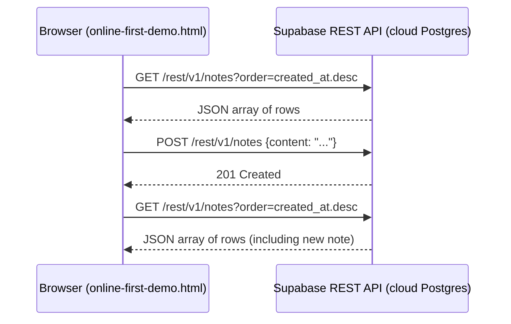
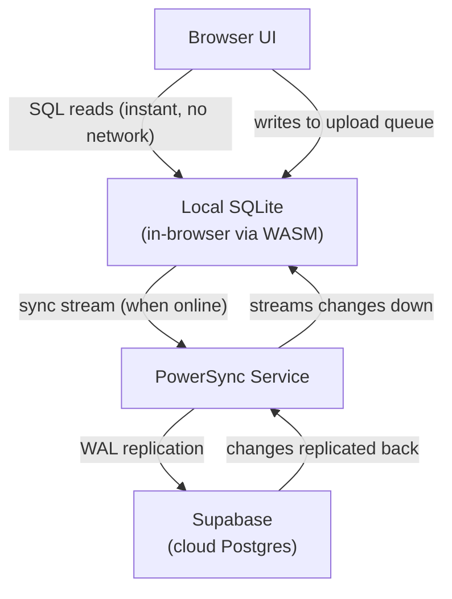

# Why Online-First Works -- and Why It's Not Enough

> **Tutorial**: [Online-First Demo](../tutorials/online-first.md) |
> **Setup**: [How to Set Up the Online-First Demo](../how-to/setup-online-first.md)

## What We Built

`online-first-demo.html` is a single self-contained HTML file that reads and writes rows in a cloud Postgres database via Supabase. No framework, no build step, no server.

The file has four sections:

| Section | What it does |
|---------|-------------|
| **Configuration** | Two constants: a Supabase project URL and a publishable API key |
| **Client** | `supabase.createClient(URL, KEY)` -- the entry point for all operations |
| **Read -- `loadNotes()`** | `.from('notes').select('*').order('created_at', { ascending: false })` fetches all rows, newest first |
| **Write -- `addNote()`** | `.from('notes').insert({ content })` writes a row, then `loadNotes()` refreshes the list |

The Supabase JS client is loaded via CDN (`@supabase/supabase-js@2`). No npm install, no bundler. This is the **online-first** model -- the simplest possible architecture for browser-to-database data access.

---

## How Data Flows

Every read and write is an HTTP request to the Supabase REST API. The JS client wraps `fetch()` calls behind a query builder.

Every operation crosses the network. There is no local state beyond the in-memory variable holding the rendered list.

---

## Why the Publishable Key Is Safe to Expose

The key in `online-first-demo.html` is a **publishable key** -- designed to be visible in client-side source code. It identifies the Supabase project but does not grant unrestricted database access.

Access control is enforced by **Row Level Security (RLS)**. In this demo, RLS is disabled on the `notes` table, making it effectively a public database. In production, RLS policies define per-user access rules (e.g., "users can only read their own rows"), and Supabase Auth attaches user identity to every request. The publishable key never changes -- the policies do the access control.

---

## The Fundamental Limitation

The online-first model has one absolute requirement: **the network must be available**.

When the network drops:
- Reads return errors -- the UI shows nothing
- Writes are lost -- the user's input disappears without persistence
- There is no local queue, no retry, no offline state

This is acceptable for many applications. It is not acceptable for mobile apps with intermittent connectivity, desktop apps that must work offline, or any scenario where data loss on disconnect is unacceptable.

---

## What Changes in the Offline-First Model

Instead of reading from Supabase on every request, the app reads from a **local SQLite database** on the device. A sync service keeps the local database synchronized with Supabase in the background.

Key differences from online-first:

- **Reads** never touch the network -- they query local SQLite with sub-millisecond latency
- **Writes** enter a local upload queue first, then sync to Supabase when connected
- **The app behaves identically online and offline** -- the sync layer is invisible to the UI code

---

## The Role of Each Technology

| Technology | Role in Online-First |
|---|---|
| **Supabase** | Hosts the Postgres database; provides the REST API |
| **Supabase JS client** | Wraps REST calls in a query builder API (`db.from('notes').select('*')`) -- loaded via CDN |
| **Publishable key** | Identifies the project; access controlled by RLS policies, not the key itself |
| **RLS** | Row Level Security -- would enforce per-user access in production; disabled here for simplicity |
| **PowerSync** | Not used in online-first; introduced in the offline-first pattern to provide local SQLite + sync |
| **SQLite WASM** | Not used in online-first; provides the in-browser database for offline-first |
| **Vite** | Not used in online-first; required by PowerSync for WASM/Worker module resolution |
