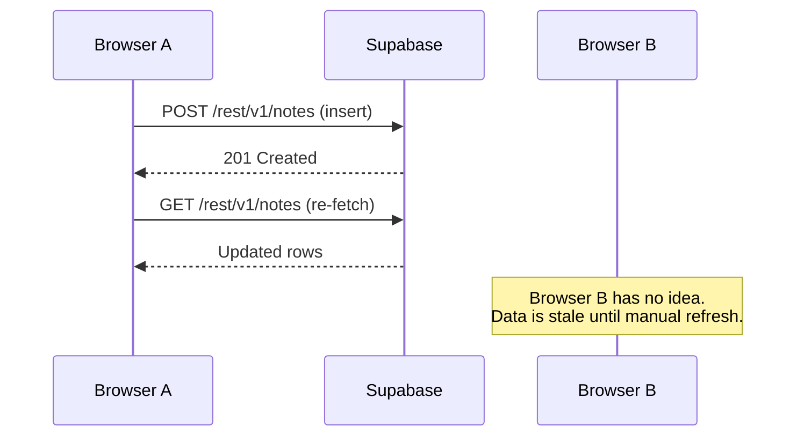
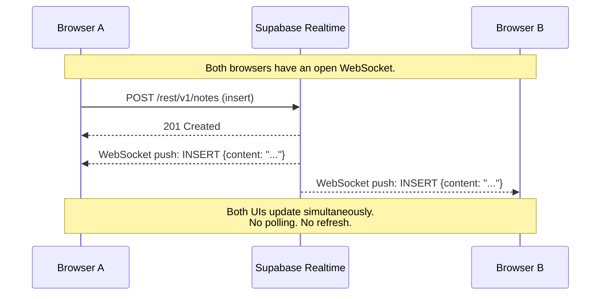
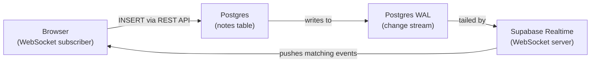

# Realtime Sync -- How Multiple Instances Stay in Step

> **Tutorial**: [Add Realtime Sync](../tutorials/online-with-sync.md) |
> **Setup**: [How to Set Up the Online Sync Demo](../how-to/setup-online-sync.md)

## What Changed from Online-First

`online-sync-demo.html` extends the online-first demo with one addition: a **Supabase Realtime subscription**. Two changes make this work:

1. `addNote()` no longer calls `loadNotes()` after writing. The subscription handles the update.
2. A new `subscribeToNotes()` function opens a persistent WebSocket connection and listens for INSERT and DELETE events on the `notes` table.

Everything else -- the Supabase client setup, the initial load, the rendering logic -- is unchanged from `online-first-demo.html`.

---

## The Problem with Request/Response

In the online-first model, a browser tab only receives data when it asks for it. If another user inserts a note, your tab has no knowledge of the change until it explicitly re-fetches.



The data in Browser B is stale from the moment Browser A writes. There is no push mechanism -- only pull.

---

## How Realtime Changes This

Supabase Realtime maintains a persistent **WebSocket** connection between each browser and Supabase. When a row changes in Postgres, Supabase pushes the change to all connected subscribers immediately. The browser does not ask -- Supabase tells it.



---

## How Supabase Realtime Works Under the Hood

The mechanism is **Postgres WAL** (Write-Ahead Log). Every write to Postgres is recorded in the WAL before it is applied to the table -- this is how Postgres guarantees durability and powers replication.

Supabase tails the WAL in real time and matches changes against active subscriptions. When a match is found, the changed row is serialized and pushed over WebSocket to every subscribed client.



Realtime updates are not a polling mechanism. They are a consequence of how Postgres already records writes. Supabase exposes that stream to browsers via WebSocket.

---

## The Publication Requirement

Supabase does not stream changes from all tables by default. Each table must be explicitly added to a Postgres **publication** called `supabase_realtime`. Without this step, the client subscription connects successfully and reports `SUBSCRIBED` -- but events never arrive. No error, no warning, just silence. This is the most common configuration mistake.

The `postgres_changes` feature is built on Postgres's **logical replication** infrastructure. A publication defines which tables' WAL entries are available to downstream consumers. Supabase Realtime is one such consumer.

See [Realtime Publication Setup](../reference/supabase-config.md#realtime-publication-setup) for the SQL and [Dashboard Locations](../reference/supabase-config.md#dashboard-locations) for where to find publication and Realtime settings.

---

## The Subscription in Code

The subscription from `online-sync-demo.html` chains INSERT and DELETE handlers on a single WebSocket channel. Multiple `.on()` calls register different event filters on the same channel -- one WebSocket connection, multiple listeners. `payload.new` contains the full inserted row; `payload.old` contains the deleted row (primary key only, by default).

See [Realtime Channel Subscription API](../reference/supabase-config.md#realtime-channel-subscription-api) for the full code example and parameter reference.

### Why `payload.old` Only Contains the ID

Postgres records deletes in the WAL using the table's **replica identity** -- the columns that uniquely identify a row. The default (`DEFAULT`) includes only primary key columns. To receive all columns in `payload.old`, set `ALTER TABLE notes REPLICA IDENTITY FULL`.

---

## Why `loadNotes()` Runs on Startup

The Realtime subscription only delivers events that occur **after** the subscription is established. It does not replay history. The startup sequence is:

```javascript
loadNotes()        // 1. Fetch existing rows via REST
subscribeToNotes() // 2. Open the WebSocket for future events
```

This ordering avoids the alternative problem: subscribing first, then fetching, which creates a window where the same note could arrive via both REST and WebSocket, requiring deduplication logic.

---

## Limitations and Failure Modes

### Network dependency remains

The app still requires a live network connection for every operation:

- **Writes fail silently.** `db.from('notes').insert(...)` returns an error if the network is down. The note is lost -- no local queue, no retry.
- **WebSocket disconnects.** The subscription stops receiving events. Notes added during the outage are invisible.
- **No catch-up on reconnect.** When the network returns, only events after reconnection are received. The UI is silently out of sync with the database.

### No UPDATE handling

The subscription listens for INSERT and DELETE only. Edits to a note's content (via dashboard or another client) are never reflected.

### No optimistic UI

After clicking Add, the note does not appear until the server round-trip completes and the WebSocket delivers the INSERT event back. On slow connections, this creates a visible delay.

### Duplicate notes from the load-then-subscribe gap

A narrow window exists where both the REST response and the WebSocket could deliver the same note. The demo does not deduplicate.

### Unbounded in-memory list

All notes are held in a single `notes` array. No pagination, no limits, no virtualization. The initial `select('*')` fetches every row.

---

## What Offline-First Solves

Offline-first addresses the core limitation: **network dependency**. In an offline-first architecture:

- Writes succeed locally even without a network -- they go into a local SQLite database and an upload queue
- The sync layer pushes queued writes when the connection returns
- The local database is the source of truth for reads -- the UI is always responsive
- Catch-up on reconnect is handled by the sync protocol, not the application
- `db.watch()` replaces manual subscriptions -- the UI reacts to any table change, whether local or synced

The next document covers how PowerSync implements this model.
