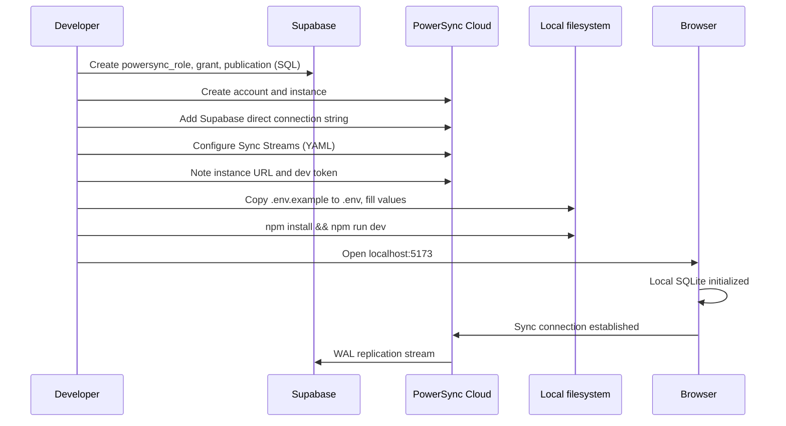
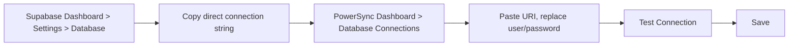
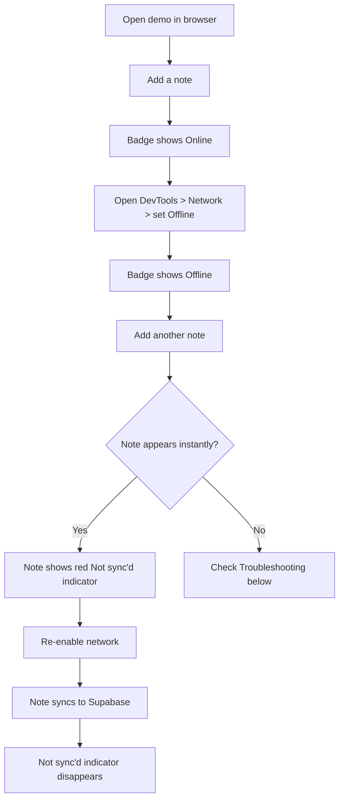
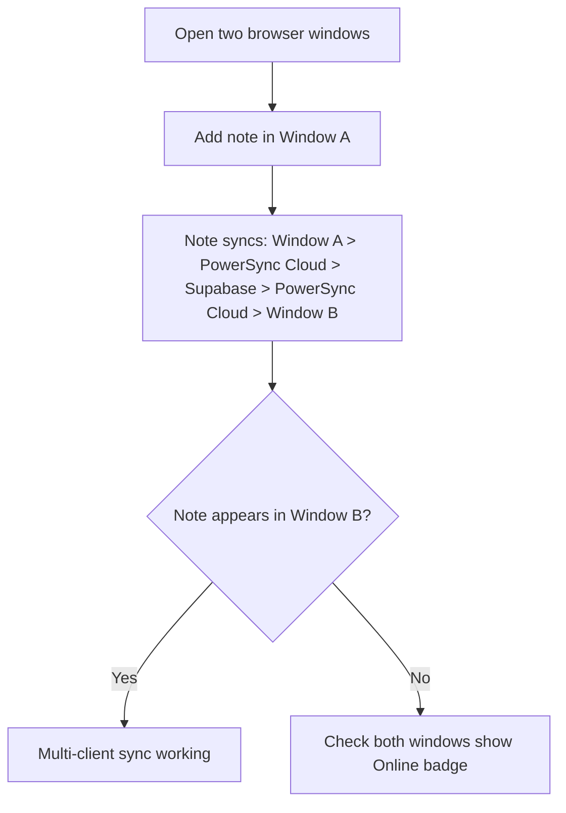

# How-To: Set Up the PowerSync Demo

Set up the offline-first notes demo that reads and writes to a local SQLite database and syncs with Supabase via PowerSync Cloud.

## Setup sequence



## Prerequisites

- A Supabase project with the `notes` table (from [How-To: Set Up the Online-First Demo](setup-online-first.md))
- Node.js and npm installed
- This repository cloned locally

## 1. Configure Supabase for replication

Run these SQL statements in the Supabase SQL Editor. PowerSync connects to Postgres via logical replication, which requires a dedicated role and publication.

<!-- Source: docs/learner/how-to/setup-powersync-demo.md:20-30 -->
```sql
-- A dedicated database role for PowerSync to connect with
CREATE ROLE powersync_role WITH REPLICATION LOGIN PASSWORD 'your-password-here';

-- Read access so PowerSync can see the data
GRANT SELECT ON ALL TABLES IN SCHEMA public TO powersync_role;
ALTER DEFAULT PRIVILEGES IN SCHEMA public
  GRANT SELECT ON TABLES TO powersync_role;

-- A publication that tells Postgres which tables to replicate
CREATE PUBLICATION powersync FOR TABLE public.notes;
```

Replace `'your-password-here'` with a strong password. You will need this password when configuring the PowerSync database connection.

## 2. Create a PowerSync Cloud account

1. Go to [powersync.com](https://www.powersync.com) and sign up for a free account
2. Create a new project

## 3. Create a PowerSync instance

1. In your project, click **Add Instance** and choose **Development**
2. Select a cloud region close to your Supabase project (check your Supabase Dashboard for the region)

## 4. Connect to Supabase



1. In the Supabase Dashboard, go to **Settings > Database > Connection string** and copy the **direct** connection string (not the pooled one -- WAL replication requires a direct connection)
2. In the PowerSync Dashboard, go to **Database Connections > Connect to Source Database**
3. Paste the connection URI
4. Replace the username with `powersync_role` and the password with the one you set in step 1
5. Click **Test Connection**, then **Save**

## 5. Configure Sync Streams

1. In the PowerSync Dashboard, go to **Sync Streams**
2. Replace the contents with:

<!-- Source: docs/learner/how-to/setup-powersync-demo.md:56-63 -->
```yaml
config:
  edition: 3

streams:
  all_notes:
    auto_subscribe: true
    query: SELECT * FROM notes
```

3. Click **Validate** to check against your database, then **Deploy**

The `auto_subscribe: true` setting means all connected clients receive this stream automatically without needing to subscribe explicitly in code.

## 6. Get instance URL and development token

1. In the PowerSync Dashboard, click **Connect** to see your instance URL (e.g., `https://your-instance.powersync.journeyapps.com`)
2. Generate or copy the development token from the same panel

## 7. Configure environment variables

```bash
cd powersync-demo
cp .env.example .env
```

Fill in the `.env` file with your values:

<!-- Source: powersync-demo/.env.example:1-4 -->
```
VITE_POWERSYNC_URL=https://your-instance.powersync.journeyapps.com
VITE_POWERSYNC_DEV_TOKEN=your-development-token
VITE_SUPABASE_URL=https://your-project.supabase.co
VITE_SUPABASE_KEY=your-publishable-key
```

## 8. Install and run

```bash
cd powersync-demo
npm install
npm run dev
```

Vite starts a development server, typically at `http://localhost:5173`.

## 9. Test offline mode



1. Open the demo and add a note -- it appears instantly
2. The sync badge shows **Online** and the note syncs to Supabase
3. Go to DevTools > Network tab and set throttling to **Offline** (or turn off Wi-Fi)
4. The sync badge changes to **Offline**
5. Add another note -- it appears instantly with a red "Not sync'd" indicator
6. Re-enable the network
7. The pending note syncs and the indicator disappears

## 10. Test multi-client sync



1. Open the demo in two separate browser windows (or an incognito window)
2. Add a note in Window A
3. The note appears in Window B within a few seconds
4. The sync path is: local SQLite (A) --> PowerSync Cloud --> Supabase --> PowerSync Cloud --> local SQLite (B)

## Conflict behavior

Creating the same note in two clients while offline produces duplicate rows -- each client generates a unique UUID. Both rows sync and appear in both clients. This is because the demo uses `INSERT` with client-generated UUIDs, so there is no primary key collision.

For update-level conflicts (two clients modifying the same row while offline), the last write to reach Supabase wins. PowerSync does not currently provide automatic merge-level conflict resolution.

## Troubleshooting

| Symptom | Likely cause | Fix |
|---|---|---|
| Badge stays on "Connecting..." | Wrong `VITE_POWERSYNC_URL` or invalid dev token | Verify values in `.env` match the PowerSync Dashboard |
| Notes don't sync to Supabase | `uploadData` failing in connector | Open DevTools Console and look for upload errors |
| Notes appear locally but not in other clients | Sync Streams not deployed | Check PowerSync Dashboard > Sync Streams > Deploy |
| "Test Connection" fails in PowerSync | Using pooled connection string | Use the **direct** connection string from Supabase |
| WASM errors in browser console | Vite not configured correctly | Verify `optimizeDeps.exclude` includes `@powersync/web` in `vite.config.js` |
| `import.meta.env` values are undefined | Missing `VITE_` prefix or `.env` in wrong directory | `.env` must be in `powersync-demo/` (not `src/`), variables must start with `VITE_` |
| Permanent upload errors filling console | Constraint violation (e.g., duplicate key) | The connector discards these automatically; check `ps_crud` table is draining |
