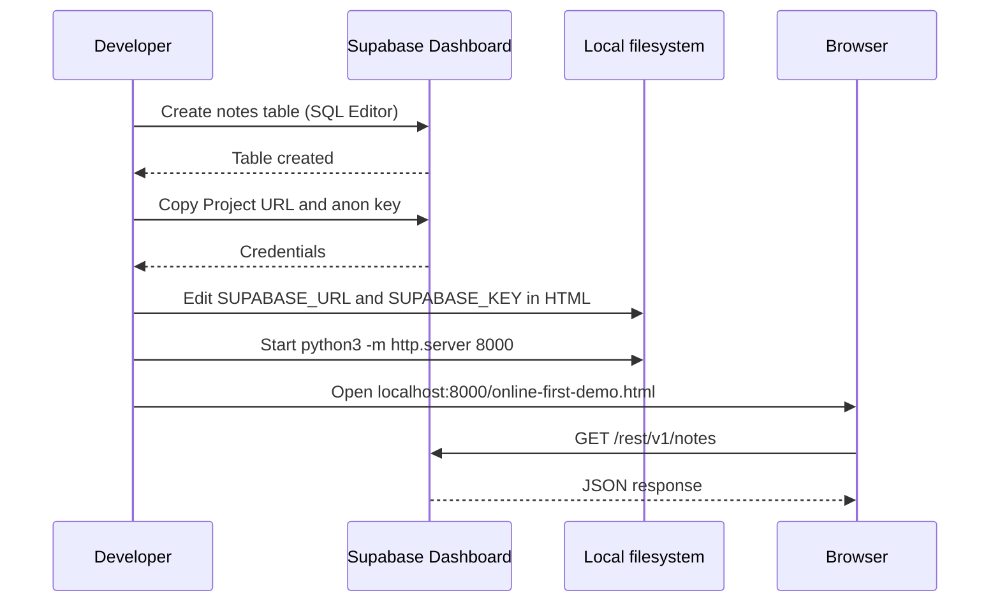
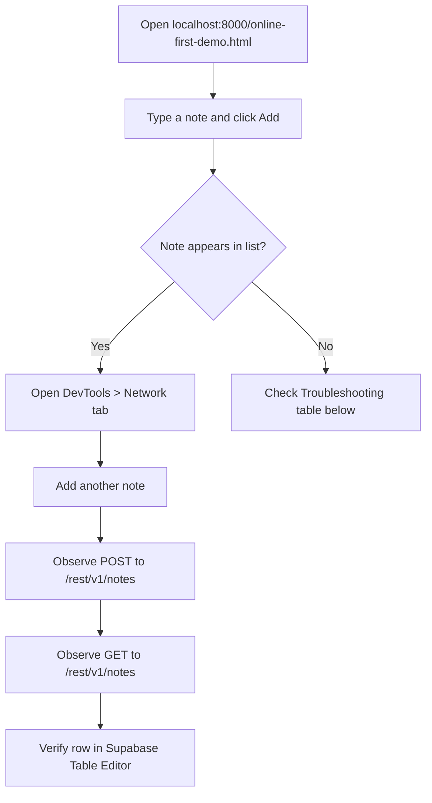

# How-To: Set Up the Online-First Demo

Set up the online-first notes demo that reads and writes directly to Supabase over REST.

## Setup sequence



## Prerequisites

- A Supabase project (free tier works)
- Python 3 (or any static file server)
- This repository cloned locally

## 1. Create the notes table

Run the `notes` table creation SQL in the Supabase SQL Editor (**SQL Editor > New Query**). See [Supabase Configuration Reference](../reference/supabase-config.md#sql-schema) for the full schema.

After creating the table, disable RLS for this learning demo (not for production):

```sql
ALTER TABLE notes ENABLE ROW LEVEL SECURITY;
CREATE POLICY "Allow all access" ON notes FOR ALL USING (true) WITH CHECK (true);
```

## 2. Get your Supabase credentials

1. Go to **Settings > API** in the Supabase Dashboard
2. Copy the **Project URL** (e.g., `https://abcdefg.supabase.co`)
3. Copy the **anon / public** key

## 3. Configure the demo

Open `online-first-demo.html` and replace the two constants:

<!-- Source: online-first-demo.html:44-45 -->
```js
const SUPABASE_URL  = 'https://your-project.supabase.co'
const SUPABASE_KEY  = 'your-publishable-key-here'
```

## 4. Serve locally

The Supabase JS client is loaded via CDN, so the file must be served over HTTP (not `file://`):

```bash
python3 -m http.server 8000
```

## 5. Test in browser



1. Open `http://localhost:8000/online-first-demo.html`
2. Type a note and click **Add**
3. Confirm the note appears in the list
4. Open **DevTools > Network** tab and add another note
5. Observe two requests: a `POST` (insert) followed by a `GET` (reload)
6. Verify the rows exist in Supabase Dashboard > **Table Editor > notes**

## Troubleshooting

| Symptom | Likely cause | Fix |
|---|---|---|
| "Error loading notes" on page load | Wrong `SUPABASE_URL` or `SUPABASE_KEY` | Double-check values from Settings > API |
| CORS error in DevTools console | File opened as `file://` | Serve via HTTP (`python3 -m http.server`) |
| Notes save but don't appear | Missing `created_at` column | Verify table schema matches the SQL above |
| 401 Unauthorized in Network tab | Key is the secret key, not the anon key | Use the **anon / public** key, not the service role key |
| Empty list after adding notes | RLS blocking reads | Verify the "Allow all access" policy was created |
