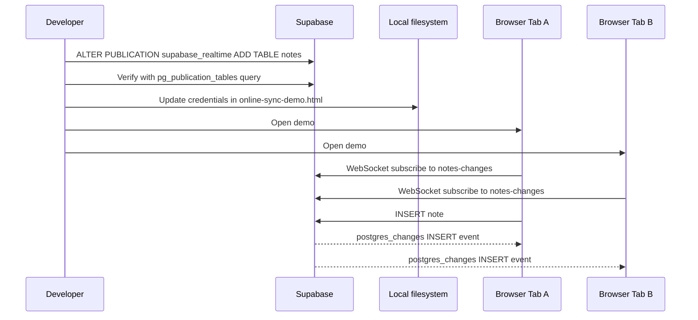
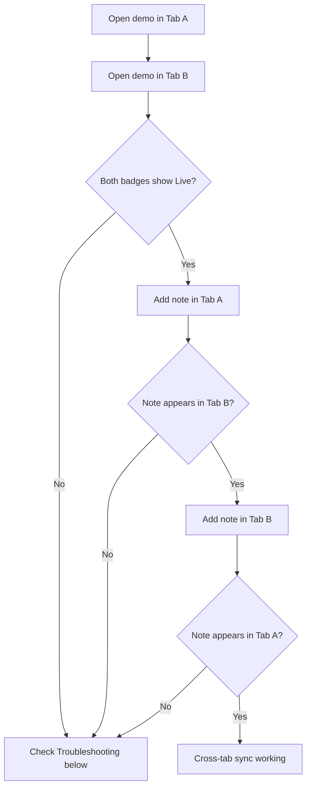
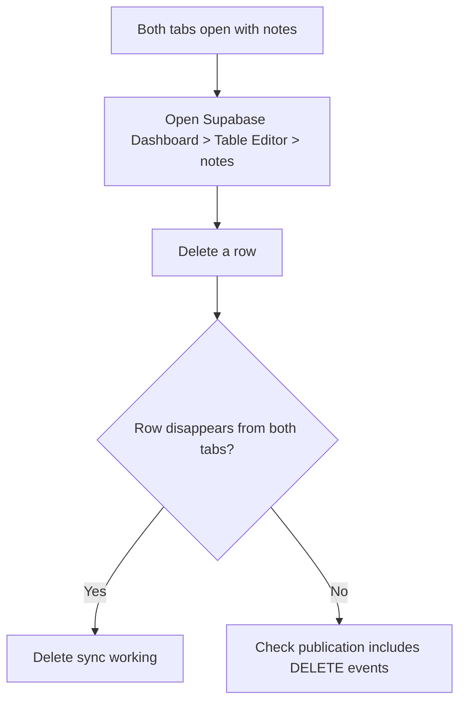

# How-To: Set Up the Online Sync Demo

Set up the Realtime sync demo that pushes note changes to all connected clients over WebSocket.

## Setup sequence



## Prerequisites

- The online-first demo working ([How-To: Set Up the Online-First Demo](setup-online-first.md))
- The `notes` table already exists in your Supabase project

## 1. Enable Realtime publication

Supabase does not broadcast changes from all tables by default. Add `notes` to the Realtime publication.

**Via SQL Editor:**

```sql
ALTER PUBLICATION supabase_realtime ADD TABLE public.notes;
```

**Via Supabase CLI:**

```bash
supabase link --project-ref <your-project-ref>
supabase db query "ALTER PUBLICATION supabase_realtime ADD TABLE public.notes;" --linked
```

**Verify:**

```sql
SELECT * FROM pg_publication_tables WHERE pubname = 'supabase_realtime';
```

The `notes` table must appear in the results before proceeding.

## 2. Update credentials

Open `online-sync-demo.html` and replace the placeholder values:

<!-- Source: online-sync-demo.html:67-68 -->
```js
const SUPABASE_URL  = 'https://your-project.supabase.co'
const SUPABASE_KEY  = 'your-publishable-key-here'
```

Use the same credentials from Settings > API that you used for the online-first demo.

## 3. Serve and open

```bash
python3 -m http.server 8000
```

Open `http://localhost:8000/online-sync-demo.html` in your browser. The badge in the header should change from "connecting..." to a green **Live** once the WebSocket connection is established.

## 4. Test cross-tab sync



1. Open the demo in two separate browser tabs, side by side
2. Confirm both tabs show the green **Live** badge
3. In Tab A, type a note and click **Add**
4. The note appears in Tab B without any refresh, with a green highlight animation
5. In Tab B, type a note and click **Add**
6. The note appears in Tab A without any refresh

## 5. Test delete sync from dashboard



1. With both tabs open, go to Supabase Dashboard > **Table Editor > notes**
2. Delete a row
3. The row disappears from both browser tabs immediately

## 6. Test disconnection behavior

1. Open the demo in one tab
2. Disconnect from the network (turn off Wi-Fi or use DevTools > Network > Offline)
3. The badge changes from **Live** to a disconnected state
4. Try adding a note -- the insert fails silently (no local persistence)
5. Reconnect to the network
6. Refresh the page to restore the full note list and re-establish the WebSocket

This demonstrates the limitation of the online-with-sync pattern: the WebSocket provides live updates, but there is no offline capability. Compare this with the [PowerSync demo](setup-offline-first.md) where writes succeed offline and sync when connectivity returns.

## Troubleshooting

| Symptom | Likely cause | Fix |
|---|---|---|
| Badge stays on "connecting..." | Realtime not enabled for `notes` table | Run the `ALTER PUBLICATION` SQL from step 1 and verify |
| Notes appear in Tab A but not Tab B | Publication not set up, or Tab B opened before subscription completed | Refresh Tab B; verify `pg_publication_tables` query |
| Badge shows "Live" but no cross-tab updates | Wrong channel name or event filter | Check browser console for WebSocket errors |
| Delete from dashboard not reflected | Default replica identity only includes primary key | Verify the subscription uses `payload.old.id` for filtering |
| "Error saving note" after clicking Add | Wrong credentials | Verify `SUPABASE_URL` and `SUPABASE_KEY` match Settings > API |
