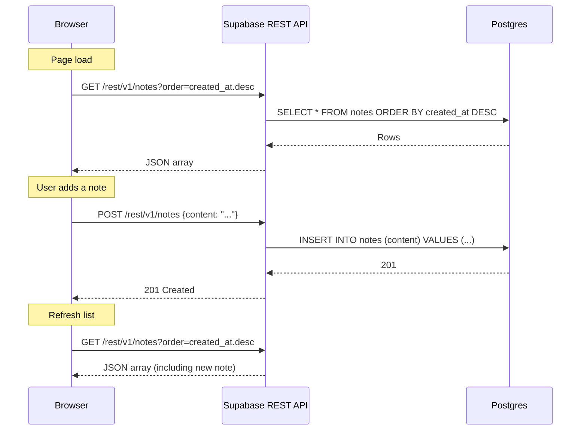
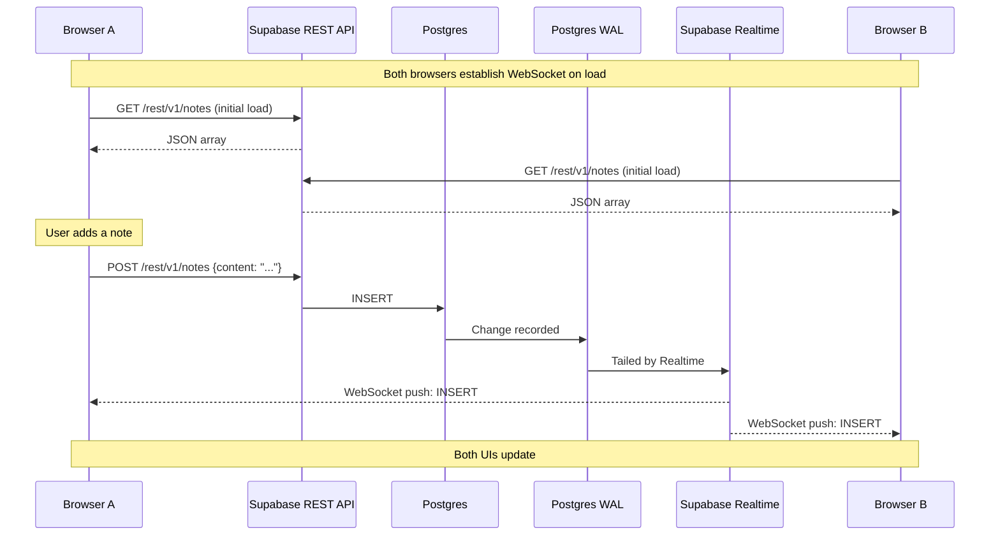
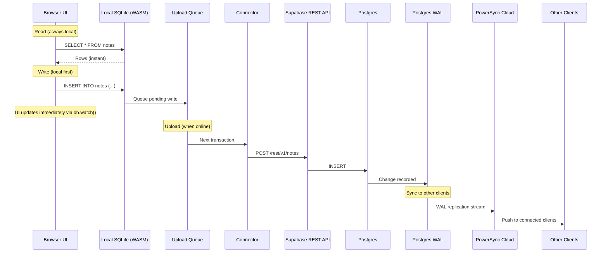

# Architecture Reference

This document provides side-by-side data flow diagrams and comparison tables for the three demo patterns: online-first, online with sync, and offline-first.

---

## Data Flow Diagrams

### Online-First (`online-first-demo.html`)

Every operation is a synchronous HTTP request to the Supabase REST API. No local state persists between page loads.



### Online with Sync (`online-sync-demo.html`)

Writes go through REST. A persistent WebSocket delivers real-time change events from Postgres WAL to all subscribed clients.



### Offline-First (`powersync-demo/`)

Reads and writes target local SQLite. PowerSync handles bidirectional sync with Supabase via WAL replication (download) and a connector upload queue (upload).



---

## Pattern Comparison

| Dimension | Online-First | Online with Sync | Offline-First (PowerSync) |
|-----------|-------------|-----------------|--------------------------|
| **Network requirement** | Every read and write | Every read and write | None -- operates offline, syncs when connected |
| **Read source** | Supabase REST API | Supabase REST (initial) + in-memory array (after) | Local SQLite database |
| **Write target** | Supabase REST API | Supabase REST API | Local SQLite + upload queue |
| **Sync model** | Request/response (pull) | WebSocket push (one-way: server to client) | Bidirectional WAL-based (PowerSync Cloud) |
| **Multi-client awareness** | None -- manual refresh required | Automatic via Realtime subscription | Automatic via sync stream |
| **Data loss on disconnect** | Writes lost, reads fail | Writes lost, subscription events missed | No loss -- writes queued, synced on reconnect |
| **Build tool required** | None (CDN `<script>` tag) | None (CDN `<script>` tag) | Vite (WASM + Web Workers + ES Modules) |
| **Local state** | In-memory JS array (lost on refresh) | In-memory JS array (lost on refresh) | Persistent SQLite database (survives refresh) |

---

## Technology Stack

| Layer | Technology | Purpose |
|-------|-----------|---------|
| **Cloud database** | Supabase (Postgres) | Source of truth for all patterns; hosts the `notes` table |
| **REST API** | Supabase REST (PostgREST) | HTTP interface for CRUD operations; used by all three patterns for writes |
| **Realtime push** | Supabase Realtime | WebSocket server that streams Postgres WAL changes to subscribers; used by online-sync |
| **Sync service** | PowerSync Cloud | Reads Postgres WAL, filters via Sync Streams, pushes to client SDKs; used by offline-first |
| **Local database** | SQLite (via `@journeyapps/wa-sqlite`) | In-browser WASM database for offline reads/writes; used by offline-first |
| **Sync SDK** | `@powersync/web` | Client library that manages local SQLite, sync stream, upload queue, and reactive queries |
| **Supabase client** | `@supabase/supabase-js` | Query builder wrapping Supabase REST API; used by all three patterns |
| **Build tool** | Vite | Dev server and bundler for WASM, Web Workers, and ES Modules; used by offline-first |
| **Background threads** | Web Workers | Run SQLite operations off the main thread; required by PowerSync Web SDK |
| **Binary execution** | WebAssembly (WASM) | Runs compiled SQLite engine in the browser at near-native speed |

---

## File Structure

```
offline-first/
  online-first-demo.html          # Pattern 1: direct Supabase REST
  online-sync-demo.html           # Pattern 2: Supabase REST + Realtime WebSocket
  powersync-demo/                  # Pattern 3: local SQLite + PowerSync sync
    src/
      index.html                   # Entry point
      index.js                     # Database setup, watch, write, status
      schema.js                    # Client-side SQLite schema
      connector.js                 # PowerSync connector (credentials + upload)
    .env                           # PowerSync URL, dev token, Supabase credentials
    vite.config.js                 # Vite config with PowerSync-specific settings
    package.json                   # Dependencies: @powersync/web, @supabase/supabase-js, wa-sqlite
```
