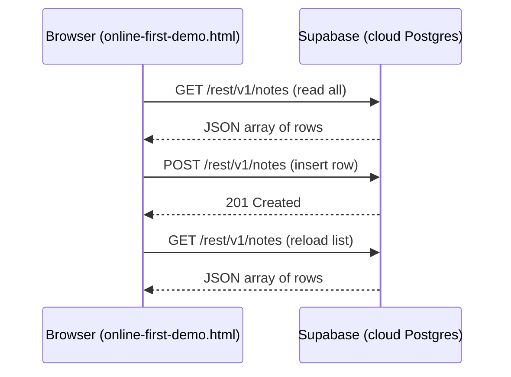
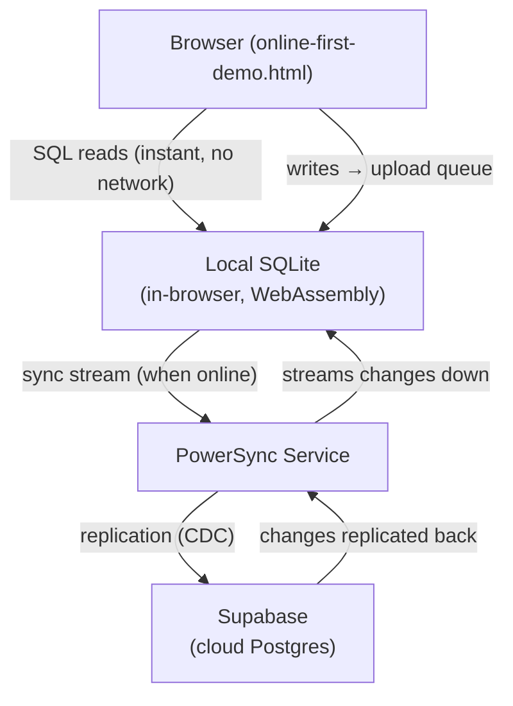

# Why Online-First Works — and Why It's Not Enough

> To set up and run this demo yourself, see [How to Set Up and Test the Online-First Demo](../how-to/02-setup-online-first-demo.md).

## What We Built

`online-first-demo.html` is a single self-contained HTML file — no framework, no build step, no server. It reads and writes rows in a real Postgres database running in the cloud.

The file is structured in four sections:

**1. Configuration** — two constants identify the Supabase project: a URL and a publishable API key.

**2. Client** — `supabase.createClient(URL, KEY)` creates the client object. Everything else goes through this object.

**3. Read — `loadNotes()`** — calls `.from('notes').select('*').order('created_at', { ascending: false })` to fetch all rows from the `notes` table, newest first. The result is an array of JSON objects rendered into a list with the note content and timestamp.

**4. Write — `addNote()`** — reads the text input, calls `.from('notes').insert({ content })` to write a new row, then calls `loadNotes()` again to refresh the list.

The Supabase client is loaded via CDN — no npm install, no bundler. This is the **online-first** model — the simplest possible architecture for data access.

---

## How the Data Flows

Every read and write crosses the network. The Supabase JS client (`db.from('notes').select('*')`) is a thin wrapper around these HTTP calls — you could do exactly the same thing with `fetch()` and raw JSON.

---

## Why the Publishable Key Is Safe to Expose

The key in `online-first-demo.html` is a **publishable key** — it's designed to be visible in browser source code. It identifies your project but doesn't grant blanket access to your database.

What controls access is **Row Level Security (RLS)**. Right now RLS is disabled on the `notes` table, which means anyone with the key can read and write anything. For this learning demo that's fine — it's equivalent to a local database with no auth.

In a real application, RLS policies define who can read or write which rows (e.g., "users can only see their own notes"). Users authenticate with Supabase Auth, which attaches their identity to every request. The key doesn't change — the policies do the access control.

---

## The Fundamental Limitation

The online-first model has one absolute requirement: **the network must be available**.

When the network drops, reads return errors and writes are lost. The app is completely non-functional. This is acceptable for many applications, but not for mobile apps with poor connectivity, desktop apps that must work offline, or any app where data loss on disconnect is unacceptable.

This is the problem **offline-first** solves.

---

## What Changes in the Offline-First Model

Instead of reading from Supabase on every request, the app reads from a **local SQLite database** on the device. A sync service keeps that local database up to date in the background.

Key differences from online-first:

- **Reads** never touch the network — they hit local SQLite instantly
- **Writes** go into a local upload queue first, then sync to Supabase when connected
- **The app behaves identically online and offline** — the sync layer is invisible to the UI

The next guide covers how PowerSync fits into this picture and what it actually does between the browser and Supabase.

---

## The Role of Each Technology

| Technology | Role |
|---|---|
| **Supabase** | Hosts the Postgres database; provides the REST API the browser calls |
| **Supabase JS client** | Wraps REST calls in a clean query API — loaded via CDN, no install needed |
| **Publishable key** | Identifies the project; access is controlled by RLS policies |
| **RLS (disabled)** | Would normally enforce per-user access — disabled here for simplicity |
