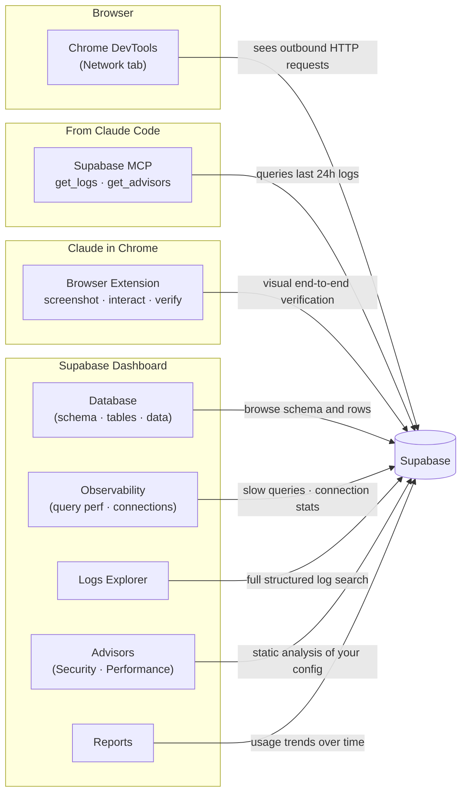

# How to Observe What Supabase Is Doing

## Why Monitoring Matters Here

Every interaction between `online-first-demo.html` and Supabase is a network call. Monitoring tools let you see those calls, diagnose failures, catch security problems, and understand performance — without guessing.

There are four places to look: the browser, the Supabase Dashboard, Claude Code, and Claude in Chrome. Within the Dashboard, there are also two structural sections worth knowing — Database and Observability — in addition to the Logs Explorer.

---

## The Monitoring Surfaces



---

## Chrome DevTools — Network Tab

The fastest way to see what the browser is sending to Supabase. Open DevTools with `Cmd+Option+I`, go to the **Network** tab, then interact with the demo. Every `loadNotes()` and `addNote()` call appears as an HTTP request in real time.

What to look for:
- **Status codes** — `200` for reads, `201` for inserts; anything `4xx` or `5xx` is an error
- **Request URL** — confirms which table and filters are being applied
- **Response body** — the raw JSON Supabase returned
- **Timing** — how long the round-trip took

This is the lowest-level view. It shows the exact HTTP conversation, which maps directly to the sequence diagram in the first guide.

---

## Supabase Dashboard — Logs Explorer

The **Supabase Dashboard** is the web UI for managing your project at [supabase.com/dashboard](https://supabase.com/dashboard). Navigate to your project → **Logs** in the left sidebar to access the Logs Explorer.

The Logs Explorer shows structured, searchable logs by service. For this demo the two relevant services are:

- **API** — every REST request your browser makes to the `notes` table
- **Postgres** — the SQL that actually ran inside the database

The other services (Auth, Storage, Edge Functions, Realtime) are not in use yet — they become relevant when the project grows.

---

## Supabase Dashboard — Database

The [**Database** section](https://supabase.com/dashboard/project/iorrrgzsprfzaboqbiwa/database/) is the structural view of your Postgres instance. This is where you see what exists, not what's happening.

Key areas:
- **Tables** — lists every table in your schema. For this demo: `notes`. Click a table to browse its rows directly in the browser.
- **Migrations** — tracks schema changes applied via the Supabase CLI. Each migration is a numbered SQL file that represents one step in the schema history.
- **Extensions** — Postgres extensions enabled on your instance (e.g., `uuid-ossp` for generating UUIDs, `pgcrypto`).
- **Roles** — the Postgres roles Supabase creates: `anon` (unauthenticated requests), `authenticated` (logged-in users), `service_role` (bypasses RLS — never expose this key).

For this demo the relevant part is Tables — you can verify that the `notes` table exists and inspect the rows your app wrote.

---

## Supabase Dashboard — Observability

The [**Observability** section](https://supabase.com/dashboard/project/iorrrgzsprfzaboqbiwa/observability) is the performance view. Where Logs Explorer shows what requests happened, Observability shows how efficiently the database is serving them.

Key areas:
- **Query Performance** — shows the slowest queries by execution time, ranked by total impact. Each entry shows the query text, how many times it ran, and how long it took on average. At this stage there is nothing meaningful here — the demo has no indexes to tune and the query volume is trivial.
- **Connection Pooling** — shows how database connections are being managed via PgBouncer (Supabase's connection pooler). Direct connections from PostgREST and pooled connections from your app appear here. Relevant when scaling.

Observability becomes useful once the app has real traffic — a slow query that runs once is noise, but one that runs 10,000 times per hour is a problem worth finding here.

---

## Supabase MCP — Logs and Advisors

**MCP** (Model Context Protocol) is a standard that lets AI tools connect to external services. This project has the Supabase MCP configured, which means Claude Code can query your Supabase project directly — fetching logs, running advisors, and executing SQL — without you opening a browser.

### Logs

Asking Claude Code to "show me the API logs" invokes `get_logs`, which returns the last 24 hours of logs for a given service. Available services: `api`, `postgres`, `auth`, `storage`, `edge-function`, `realtime`, `branch-action`.

### Advisors

`get_advisors` runs static analysis against your project configuration and returns actionable findings. Two types:

**Security advisors** flag configuration risks. This project currently has one:

> **RLS Disabled in Public** (ERROR) — `public.notes` is exposed to the API but has no Row Level Security policy. Any request with the publishable key can read or write any row. Intentional for this demo; must be addressed before any real data is stored.
> Remediation: [supabase.com/docs/guides/database/database-linter?lint=0013_rls_disabled_in_public](https://supabase.com/docs/guides/database/database-linter?lint=0013_rls_disabled_in_public)

**Performance advisors** flag configuration inefficiencies:

> **Auth DB Connection Strategy is not Percentage** (INFO) — Auth is configured with a fixed connection count of 10. Scaling the instance won't improve Auth performance unless this is switched to a percentage-based strategy.
> Remediation: [supabase.com/docs/guides/deployment/going-into-prod](https://supabase.com/docs/guides/deployment/going-into-prod)

Advisors are worth running after any schema change — they automatically catch things like missing RLS policies and index gaps.

---

## Claude in Chrome

The **Claude in Chrome** extension (available from the Chrome Web Store) adds two capabilities to your browser:

1. **Side panel chat** — a Claude conversation pane accessible from any page via the extension icon. Useful for asking questions about what you're looking at without switching context.
2. **MCP bridge** — when Claude Code is running, the extension connects your browser to Claude Code as an MCP server. This lets Claude Code take screenshots, navigate pages, click elements, and read page content directly.

For this demo, Claude in Chrome is a visual end-to-end testing surface. You can ask Claude Code to:

- Navigate to `http://localhost:8081/online-first-demo.html` and take a screenshot — confirming the page renders and notes load
- Type a note and click **Add** — verifying the full write cycle through the actual UI, not just the API
- Navigate to the Supabase Table Editor and confirm the row appeared in the database

This is different from Chrome DevTools (which shows raw HTTP) or the Logs Explorer (which shows server-side events). Claude in Chrome verifies the user-visible result: did the right thing appear on screen?

The extension labels your browser windows with tab groups: **Claude** marks windows where the side panel is open, **Claude (MCP)** marks the window connected to Claude Code for automation.

---

## What Real Logs Look Like

After a few interactions with `online-first-demo.html`, the API logs show a consistent pattern for each write cycle:

```
OPTIONS 200 /rest/v1/notes                              ← CORS preflight (automatic)
POST    201 /rest/v1/notes                              ← addNote() inserted a row
OPTIONS 200 /rest/v1/notes                              ← preflight for the reload
GET     200 /rest/v1/notes?select=*&order=created_at.desc  ← loadNotes() reloaded the list
```

The `OPTIONS` requests are **CORS preflights**. Before a browser sends a cross-origin request (one going to a different domain, like `supabase.co`), it first asks the server "will you accept this kind of request from my origin?" Supabase says yes, and then the real request goes through. This is a browser security mechanism, not something the app controls.

The Postgres logs are noisier. Most of it is background infrastructure:

- **`postgres_exporter`** — Supabase's metrics collector, connects every 60 seconds to gather database statistics. Always present, always ignorable.
- **`postgrest`** — the REST API layer that sits between your browser and Postgres. When your browser calls `/rest/v1/notes`, PostgREST receives it, translates it to SQL, runs it against Postgres, and returns JSON. A `postgrest` connection in the logs means a REST request was served.
- **`checkpoint`** — Postgres flushing its **WAL** (Write-Ahead Log) to disk. The WAL is how Postgres ensures durability — every write is logged before it's committed. Checkpoints are routine maintenance.

The signal to look for in Postgres logs is the `postgrest` connection — it appears exactly when your browser makes a request, confirming the full path from browser → REST API → database is working.

---

## When to Use Each Tool

- **Did my request succeed?** → Chrome DevTools Network tab — fastest feedback, no setup
- **Did the right thing appear on screen?** → Claude in Chrome — screenshot the page and verify visually
- **Does the full write cycle work end-to-end?** → Claude in Chrome — type a note, click Add, confirm it appears
- **What SQL actually ran?** → Dashboard → Postgres logs
- **Why is something failing?** → Dashboard → API logs — shows the full request and error
- **What does my schema look like? What rows are in the table?** → Dashboard → Database → Tables
- **Are my slow queries a problem?** → Dashboard → Observability → Query Performance
- **Is my schema secure?** → ask Claude Code to run the security advisors
- **Are there performance problems?** → ask Claude Code to run the performance advisors
- **How much traffic am I getting?** → Dashboard → Reports
