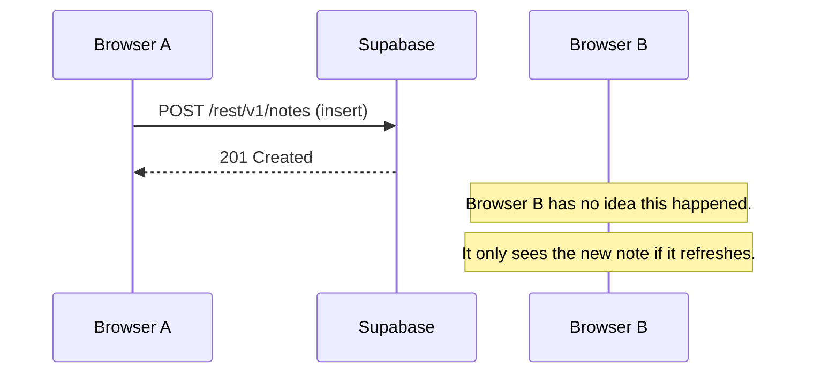
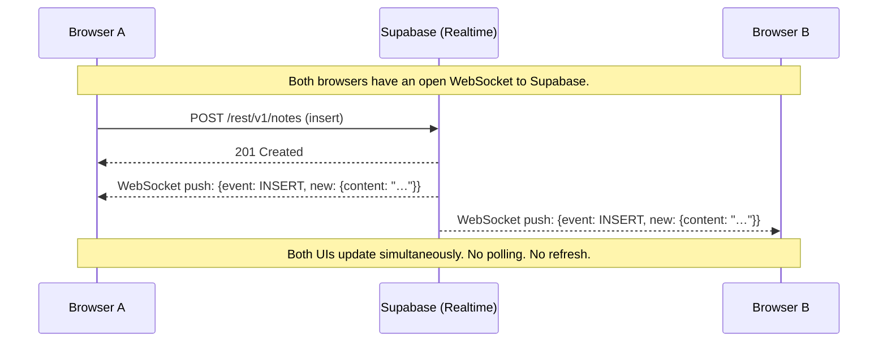
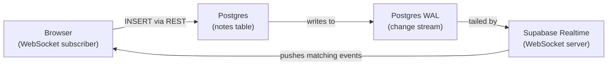

# Realtime Sync — How Multiple Instances Stay in Step

## What We Built

`realtime-sync-demo.html` extends the online-first demo with one critical addition: a **Supabase Realtime subscription**. Open the file in two tabs side by side and type a note in one — it appears in the other instantly, with no refresh.

The file structure is the same as `online-first-demo.html`, with two changes:

1. `addNote()` no longer calls `loadNotes()` after writing. The subscription handles the update instead.
2. A new `subscribeToNotes()` function opens a persistent WebSocket connection and listens for both INSERT and DELETE events on the `notes` table.

Everything else — the Supabase client, the initial load, the rendering — is unchanged.

Deletes are intentionally not available through the app's UI. Instead, delete a row via the Supabase dashboard — every open instance removes it from its list immediately.

---

## The Problem with the Online-First Model

In `online-first-demo.html`, the only way for a tab to see new notes is to reload the page or add a note itself (which triggers a re-fetch). If another user adds a note in their browser, your tab has no idea. The data is stale until you manually refresh.

This is the fundamental limitation of a **request/response** model: the browser only receives data when it asks for it.



---

## How Realtime Sync Changes This

Supabase Realtime maintains a persistent **WebSocket** connection between the browser and Supabase. When a row changes in Postgres, Supabase pushes the change to all connected subscribers immediately.

The browser doesn't ask — Supabase tells it.



---

## How Supabase Realtime Works

The mechanism underneath is **Postgres WAL** (Write-Ahead Log). Every write to Postgres is recorded in the WAL before it's applied — this is how Postgres guarantees durability and powers replication.

Supabase tails that log in real time and looks for changes that match active subscriptions. When it finds one, it serializes the changed row and pushes it over WebSocket to every subscribed client.



This means realtime updates are **not a polling mechanism** — they are a consequence of how Postgres already records writes. Supabase just exposes that stream to browsers.

---

## Enabling Realtime for a Table

Supabase does not stream changes from all tables by default. Each table must be explicitly added to a Postgres **publication** called `supabase_realtime`. Without this step, the client subscription connects successfully and reports `SUBSCRIBED` — but events never arrive. No error, no warning, just silence.

The setup is a single SQL statement:

```sql
alter publication supabase_realtime add table public.notes;
```

You can run this via the Supabase CLI:

```bash
supabase link --project-ref <your-project-ref>
supabase db query "alter publication supabase_realtime add table public.notes;" --linked
```

Or via the Supabase MCP `execute_sql` tool if you're using an AI agent.

To verify the table is in the publication:

```sql
select * from pg_publication_tables where pubname = 'supabase_realtime';
```

### Why this step is easy to miss

The `postgres_changes` feature is built on Postgres's **logical replication** infrastructure. A publication is a Postgres concept that defines which tables' WAL entries are made available to downstream consumers. Supabase Realtime is one such consumer — it reads the `supabase_realtime` publication to know which changes to stream.

The term "publication" comes from Postgres, not Supabase. In the Supabase dashboard, you'll find this setting under **Database → Publications** — not under the Realtime section, because it's a database-level configuration.

### Where things live in the dashboard

The Supabase dashboard splits Realtime configuration across three locations, because they operate at different layers:

| Location | What it does |
|---|---|
| **Database → Publications** | Controls which tables are in the `supabase_realtime` publication. This is the Postgres layer — it determines what data enters the WAL stream. |
| **Realtime → Settings** | Controls the Realtime WebSocket service itself — enable/disable, connection limits, max events per second. |
| **Realtime → Inspector** | A live debugging tool. You manually type a channel name, click "Start listening", and watch events flow. It does not auto-discover channels — channels are ephemeral and only exist while clients are subscribed. |

The Inspector is useful for verifying that events are actually flowing after you've configured a publication. But it's a debugging tool, not a configuration surface.

---

## The Subscription in Code

Both INSERT and DELETE handlers are chained on the same channel. A single WebSocket connection carries both event types.

```javascript
db.channel('notes-changes')
  .on(
    'postgres_changes',
    { event: 'INSERT', schema: 'public', table: 'notes' },
    (payload) => {
      const newNote = payload.new   // the newly inserted row
      notes.unshift(newNote)
      renderNotes(notes, newNote.id)
    }
  )
  .on(
    'postgres_changes',
    { event: 'DELETE', schema: 'public', table: 'notes' },
    (payload) => {
      notes = notes.filter(n => n.id !== payload.old.id)
      renderNotes(notes)
    }
  )
  .subscribe()
```

- `channel('notes-changes')` — creates a named WebSocket channel. The name is arbitrary.
- `postgres_changes` — the listener type for database row changes (as opposed to presence or broadcast).
- Chaining multiple `.on()` calls — each handles a different event type on the same channel. One WebSocket, multiple event filters.
- `payload.new` — the full inserted row for INSERT events.
- `payload.old` — the deleted row for DELETE events. With Postgres's default replica identity, only the primary key (`id`) is guaranteed to be present — which is all we need to remove the note from the local list.

### Why `payload.old` only has the id

Postgres records deletes in the WAL using the table's **replica identity** — the set of columns it uses to identify a row uniquely. The default is `DEFAULT`, which only includes primary key columns. To receive all columns in `payload.old`, a table needs `ALTER TABLE notes REPLICA IDENTITY FULL`. For this demo, the `id` alone is sufficient.

---

## Why We Still Call `loadNotes()` on Startup

The realtime subscription only delivers events that happen *after* the subscription is established. It does not replay history. So on first load we still fetch existing notes via REST — then the subscription takes over for everything that happens after.

The order of operations matters:

```javascript
loadNotes()       // fetch existing rows via HTTP
subscribeToNotes() // then open the WebSocket
```

If you subscribed before fetching, you could miss notes that were inserted in the narrow window between the fetch completing and the subscription establishing. By subscribing first and fetching second, you might receive a duplicate (the same note via REST and via subscription) — which requires deduplication logic. The approach in this demo — load then subscribe — is the simplest correct ordering for an append-only list.

---

## Limitations and Failure Modes

This demo is intentionally simple. That simplicity exposes several real failure modes that a production app would need to handle.

### Network dependency — the fundamental limitation

The app still requires a live network connection for everything. If the network drops:

- **Writes fail silently.** `addNote()` calls `db.from('notes').insert(...)` over HTTP. If the network is down, the insert returns an error and the note is lost — the user typed it, hit Add, and it's gone. There is no local queue, no retry, no persistence.
- **The WebSocket disconnects.** The subscription stops receiving events. The "Live" badge may or may not update (it depends on whether the disconnect is clean or abrupt). Notes added by other users during the outage are invisible.
- **No catch-up on reconnect.** When the network returns, the subscription resumes — but it only receives events that happen *after* reconnection. Anything that was inserted or deleted while disconnected is missing from the local list. The UI is now out of sync with the database, and the user has no way to know.

This is the same fundamental limitation as the online-first model, just expressed differently. The app is still network-dependent.

### Duplicate notes from the load-then-subscribe gap

On startup, the app calls `loadNotes()` then `subscribeToNotes()`. There is a narrow window where both the REST response and the WebSocket could deliver the same note. If another client inserts a note in that gap, it could appear twice in the list. The demo does not deduplicate.

### No UPDATE handling

The subscription listens for INSERT and DELETE only. If a note's content were edited (via the Supabase dashboard or another client), the change would not appear. The local `notes` array would hold stale data indefinitely.

### Unbounded in-memory list

Every note ever inserted is held in the `notes` array. The app fetches all rows on startup (`select('*')`) and never discards any. With enough notes, this causes:

- Slow initial load (all rows transferred over the network)
- Growing memory usage (every note lives in the DOM and in the array)
- No pagination, no virtualization, no limit

### No authentication or authorization

The app uses a publishable key with RLS disabled. Any browser with the key can read and write any row. There is no user identity, no access control, and no way to scope notes to a specific user.

### No optimistic UI

When the user clicks Add, the input clears but the note doesn't appear until the server round-trip completes *and* the WebSocket delivers the INSERT event back. On a slow connection, this creates a visible delay — the user sees nothing happen for a moment after clicking. A production app would insert the note into the local list immediately (optimistic update) and reconcile when the server confirms.

### No error recovery

If the initial `loadNotes()` fails, the app shows an error message but has no retry mechanism. If the WebSocket disconnects, the badge may update but the app does not attempt to reconnect or re-fetch missed events. The user must manually refresh the page.

### Single-table, append-only model

The demo only handles one table with one operation pattern (insert notes, delete notes). Real applications have relationships between tables, concurrent edits to the same row, and ordering conflicts. None of these problems exist in this demo, which makes it a poor model for anything beyond a toy.

---

## What Offline-First Solves

**Offline-first** addresses the most critical limitation: network dependency. In an offline-first architecture:

- Writes succeed locally even without a network — they go into a local database and an upload queue
- The sync layer automatically pushes queued writes when the connection returns
- The local database is the source of truth for reads, so the UI is always responsive
- Catch-up on reconnect is handled by the sync protocol, not by the application

The next guide covers how PowerSync fits into this picture.

---

## The Role of Each Technology

| Technology | Role |
|---|---|
| **Supabase REST API** | Initial load of existing notes via HTTP |
| **Supabase Realtime** | WebSocket server that streams Postgres change events |
| **Postgres WAL** | The mechanism Supabase tails to detect row changes |
| **`postgres_changes` listener** | Client-side filter that routes relevant events to the callback |
| **`payload.new`** | The inserted row — no extra fetch needed to get the data |
| **`payload.old`** | The deleted row — only primary key by default; sufficient to remove from local list |
| **Replica identity** | Postgres setting controlling which columns appear in `payload.old` for deletes |
| **`supabase_realtime` publication** | Postgres publication that controls which tables' changes are streamed — must be configured explicitly |
