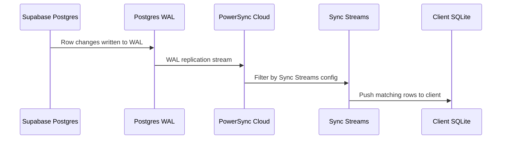
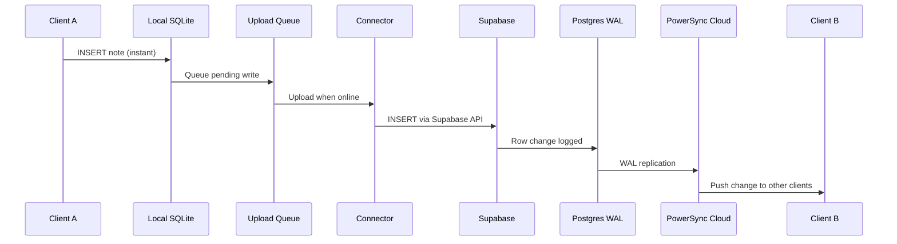
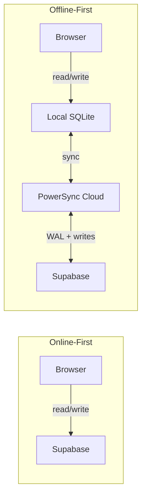

# Offline-First with PowerSync

## What changed and why

The first two demos (`online-first-demo.html` and `online-sync-demo.html`) talk directly to Supabase. Every read and every write requires a network connection. If you open those pages with your Wi-Fi off, you get nothing — no data loads, no notes can be saved.

The PowerSync demo flips this model. Instead of reading from and writing to Supabase over the network, the app reads from and writes to a **local SQLite database** that lives in your browser. PowerSync then handles syncing that local database with Supabase in the background, when connectivity is available.

This is the core idea behind **offline-first** (also called **local-first**): the app works without a network connection, and sync happens opportunistically.

> For setup and testing steps, see [How to Set Up and Test the PowerSync Demo](../how-to/01-setup-powersync-demo.md).

## Why we needed a bundler

The online-first demos are single HTML files that load the Supabase client from a CDN `<script>` tag. No build step, no npm — just open the file and go.

PowerSync's Web SDK can't work this way. It needs:

1. **WASM (WebAssembly)** — SQLite runs as a compiled WASM binary inside your browser. WASM files need to be served with the right headers and loaded correctly by the JavaScript runtime.

2. **Web Workers** — Database operations run in a background thread (a Web Worker) so they don't block the UI. Workers are separate JavaScript files that the browser loads on demand.

3. **ES Modules with dynamic imports** — JavaScript has two ways to load code. The old way is `<script>` tags, where everything shares one global scope. The modern way is ES Modules (`import`/`export`), where each file explicitly declares what it uses and what it exposes. ("ES" stands for ECMAScript — the official specification name for JavaScript, maintained by Ecma International, originally the European Computer Manufacturers Association.) PowerSync's SDK uses ES Modules internally, and it uses `import()` (a dynamic, on-demand version of `import`) to load workers and WASM files at runtime. A plain `<script>` tag can't do this — it needs a module-aware bundler to resolve those imports.

A CDN `<script>` tag can't handle any of these. So we introduced [Vite](https://vite.dev) — a fast, minimal build tool that understands ES Modules natively and can serve WASM and workers in development without extra configuration.

## The Vite configuration

Two settings in `vite.config.js` are specific to PowerSync:

```js
optimizeDeps: {
  exclude: ['@powersync/web']
},
worker: {
  format: 'es'
}
```

- **`optimizeDeps.exclude`** tells Vite not to pre-bundle the PowerSync package. Vite normally pre-bundles dependencies to speed up page loads, but this process breaks packages that contain web workers and WASM files — it strips out the worker entry points and the WASM binary paths no longer resolve correctly.

- **`worker.format: 'es'`** tells Vite to serve web worker scripts as ES modules (using `import`/`export`) rather than classic scripts. PowerSync's workers use ES module syntax internally, so they need this format to load.

## The schema

PowerSync uses a client-side schema to define what tables exist in the local SQLite database:

```js
import { column, Schema, Table } from '@powersync/web'

const notes = new Table({
  content: column.text,
  created_at: column.text
})

export const AppSchema = new Schema({ notes })
```

This mirrors the `notes` table in Supabase, with two differences:

1. **No `id` column** — PowerSync automatically creates a UUID `id` column on every table. You don't declare it in the schema, but you can read and write it in queries.

2. **Everything is `text`, `integer`, or `real`** — PowerSync's local SQLite uses these three column types. Timestamps like `created_at` are stored as `text` (ISO 8601 strings), not a native date type.

## Keeping schemas in sync

There are three schema definitions in this architecture, and they are **not automatically synchronized**:

| Schema | Where it lives | What it defines |
|--------|---------------|-----------------|
| Supabase Postgres | SQL migrations | The source-of-truth table structure (`CREATE TABLE notes ...`) |
| Sync Streams | PowerSync Dashboard (YAML) | Which columns and rows to replicate (`SELECT * FROM notes`) |
| Client SQLite | `schema.js` in your app code | The local table structure PowerSync creates in the browser |

If you change the Supabase table — say, adding an `updated_at` column — you need to update all three:

1. **Supabase** — add the column via a migration
2. **Sync Streams** — if your query uses `SELECT *`, it picks up the new column automatically. If you list columns explicitly, add the new one.
3. **Client schema** — add `updated_at: column.text` to the `notes` Table definition in `schema.js`. Without this, the local SQLite table won't have the column, and synced data for that field will be silently dropped.

Missing step 3 is a common gotcha — Supabase has the column, Sync Streams replicate it, but the client never sees the data because the local schema doesn't declare it.

**Shortcut:** The PowerSync Dashboard has a **Client SDK Setup** page that generates the client schema from your deployed Sync Streams config. Click **Client SDK Setup** in the sidebar, select your language, and copy the generated schema. This is a one-time generation tool, not a live sync — you still need to update it manually when the schema changes.

## How sync actually works

The app reads and writes to a local SQLite database — completely offline. But how does that data eventually reach Supabase (and other clients)?

PowerSync uses **PostgreSQL's Write-Ahead Log (WAL)** to detect changes. Here's the flow:



1. **WAL replication** — Every time a row changes in Supabase's Postgres database, the change is written to the WAL (a sequential log that Postgres uses internally for crash recovery). PowerSync reads this log in real-time to know what changed.

2. **Sync Streams** — A configuration on the PowerSync Cloud side that defines *which* tables and rows to sync to *which* clients. Think of it as a filter: "send all rows from the `notes` table to every connected client."

3. **Client sync** — The PowerSync SDK on the client maintains a persistent connection to PowerSync Cloud. When changes arrive via WAL, PowerSync pushes them down to the client's local SQLite. When the client writes locally, the SDK queues the changes and uploads them to Supabase through the connector.



### Why a dedicated replication role

PowerSync needs `REPLICATION` privilege to read the WAL. The built-in Supabase roles don't have this. Creating a separate role with only `SELECT` + `REPLICATION` follows the principle of least privilege — PowerSync can read changes but can't modify data through this connection.

### Why a publication

Postgres WAL contains changes for *every* table. A publication acts as a filter: "only replicate changes to the `notes` table." Without this, PowerSync would receive (and have to discard) changes from system tables, auth tables, and anything else in the database. Using `FOR TABLE public.notes` instead of `FOR ALL TABLES` keeps it targeted.

### Why ALTER DEFAULT PRIVILEGES

The `GRANT SELECT` only applies to tables that exist *right now*. `ALTER DEFAULT PRIVILEGES` ensures that any tables created in the future automatically get the same SELECT grant for `powersync_role`. This is forward-looking — if we add more tables later, we won't need to remember to grant access again.

## What the connector does

The connector is a class with two methods that PowerSync calls automatically:

- **`fetchCredentials()`** — returns the PowerSync Cloud URL and an authentication token. The SDK calls this every few minutes to keep the connection alive. In our demo, it returns the dev token from the `.env` file. In a real app, it would call Supabase Auth to get a fresh JWT for the current user.

- **`uploadData(database)`** — sends locally-written rows to Supabase. Whenever you insert, update, or delete a note locally, PowerSync queues that change. The SDK calls `uploadData` to process the queue. Inside, it:
  1. Gets the next transaction from the queue (`getNextCrudTransaction`)
  2. Iterates each operation in the transaction
  3. Maps each operation type to a Supabase call:
     - **PUT** → `supabase.from('notes').upsert(record)` (insert or replace)
     - **PATCH** → `supabase.from('notes').update(fields).eq('id', id)` (update specific fields)
     - **DELETE** → `supabase.from('notes').delete().eq('id', id)`
  4. Marks the transaction as complete, removing it from the upload queue

If an upload fails with a transient error (network timeout), PowerSync retries automatically. If it fails permanently (constraint violation), the connector discards the transaction so it doesn't block the queue.

### Wiring it up

After initializing the database, one line connects everything:

```js
const connector = new SupabaseConnector()
db.connect(connector)
```

From this point, two things happen in parallel:
- **Download path** — PowerSync Cloud pushes data from Supabase (via WAL) into the local SQLite
- **Upload path** — the connector sends local writes to Supabase via the upload queue

## Reactive UI with db.watch()

In the initial local-only version, we called `loadNotes()` manually after every insert. With sync, notes can arrive from other clients at any time — we can't predict when to reload.

`db.watch()` solves this. It returns an async iterable that emits new query results whenever the underlying table changes — whether from a local write or a sync from PowerSync Cloud:

```js
for await (const result of db.watch('SELECT * FROM notes ORDER BY created_at DESC')) {
  renderNotes(result)
}
```

This replaces the manual reload pattern entirely. The UI updates automatically, whether you added a note or another device did.

## The sync badge

The UI shows a status badge (like the "Live" badge in the online-sync demo):
- **Synced** (green) — connected to PowerSync Cloud, sync is active
- **Connecting...** (red) — establishing connection
- **Offline** (red) — no connection, working from local data only

This uses the `registerListener` API on the database:

```js
db.registerListener({
  statusChanged: (status) => {
    // status.connected, status.connecting, status.uploading, status.downloading
  }
})
```

The badge provides immediate visual feedback about connectivity state, replacing the need to manually check sync status.

## Architecture comparison



| Aspect | Online-First | Offline-First (PowerSync) |
|--------|-------------|--------------------------|
| Where data lives | Supabase (remote) | Local SQLite + Supabase (synced) |
| Network required? | Yes, for every operation | No — works offline, syncs later |
| Read latency | Network round-trip (~50-200ms) | Local disk (~1-5ms) |
| Write latency | Network round-trip | Local disk (instant feel) |
| Build tooling | None (CDN script tag) | Vite (for WASM + workers) |
| Conflict handling | N/A (single source of truth) | PowerSync manages merge conflicts |
