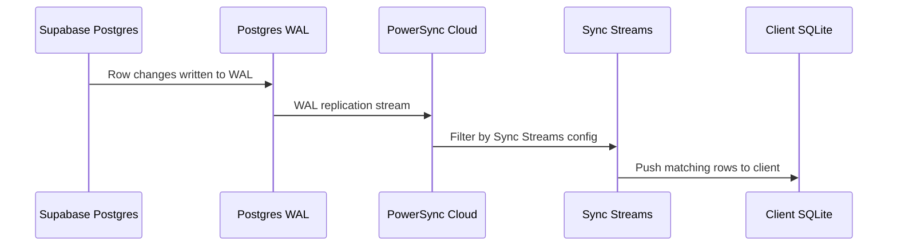
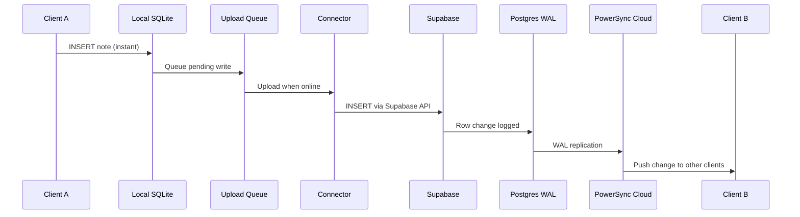
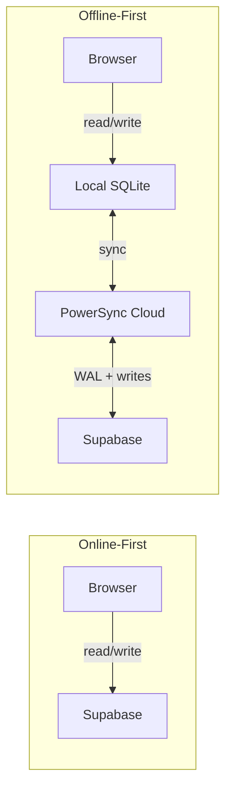

# Offline-First with PowerSync

## What changed and why

The first two demos (`online-first-demo.html` and `online-sync-demo.html`) talk directly to Supabase. Every read and every write requires a network connection. If you open those pages with your Wi-Fi off, you get nothing — no data loads, no notes can be saved.

The PowerSync demo flips this model. Instead of reading from and writing to Supabase over the network, the app reads from and writes to a **local SQLite database** that lives in your browser. PowerSync then handles syncing that local database with Supabase in the background, when connectivity is available.

This is the core idea behind **offline-first** (also called **local-first**): the app works without a network connection, and sync happens opportunistically.

## Why we needed a bundler

The online-first demos are single HTML files that load the Supabase client from a CDN `<script>` tag. No build step, no npm — just open the file and go.

PowerSync's Web SDK can't work this way. It needs:

1. **WASM (WebAssembly)** — SQLite runs as a compiled WASM binary inside your browser. WASM files need to be served with the right headers and loaded correctly by the JavaScript runtime.

2. **Web Workers** — Database operations run in a background thread (a Web Worker) so they don't block the UI. Workers are separate JavaScript files that the browser loads on demand.

3. **ES Modules with dynamic imports** — JavaScript has two ways to load code. The old way is `<script>` tags, where everything shares one global scope. The modern way is ES Modules (`import`/`export`), where each file explicitly declares what it uses and what it exposes. ("ES" stands for ECMAScript — the official specification name for JavaScript, maintained by Ecma International, originally the European Computer Manufacturers Association.) PowerSync's SDK uses ES Modules internally, and it uses `import()` (a dynamic, on-demand version of `import`) to load workers and WASM files at runtime. A plain `<script>` tag can't do this — it needs a module-aware bundler to resolve those imports.

A CDN `<script>` tag can't handle any of these. So we introduced [Vite](https://vite.dev) — a fast, minimal build tool that understands ES Modules natively and can serve WASM and workers in development without extra configuration.

## The Vite configuration

Two settings in `vite.config.js` are specific to PowerSync:

```js
optimizeDeps: {
  exclude: ['@powersync/web']
},
worker: {
  format: 'es'
}
```

- **`optimizeDeps.exclude`** tells Vite not to pre-bundle the PowerSync package. Vite normally pre-bundles dependencies to speed up page loads, but this process breaks packages that contain web workers and WASM files — it strips out the worker entry points and the WASM binary paths no longer resolve correctly.

- **`worker.format: 'es'`** tells Vite to serve web worker scripts as ES modules (using `import`/`export`) rather than classic scripts. PowerSync's workers use ES module syntax internally, so they need this format to load.

## The schema

PowerSync uses a client-side schema to define what tables exist in the local SQLite database:

```js
import { column, Schema, Table } from '@powersync/web'

const notes = new Table({
  content: column.text,
  created_at: column.text
})

export const AppSchema = new Schema({ notes })
```

This mirrors the `notes` table in Supabase, with two differences:

1. **No `id` column** — PowerSync automatically creates a UUID `id` column on every table. You don't declare it in the schema, but you can read and write it in queries.

2. **Everything is `text`, `integer`, or `real`** — PowerSync's local SQLite uses these three column types. Timestamps like `created_at` are stored as `text` (ISO 8601 strings), not a native date type.

## What this step accomplished

After this step, the demo app can:
- Open a local SQLite database in the browser (via WASM)
- Insert notes into the local database
- Query and display notes from the local database
- Work entirely offline — no network calls at all

What it **cannot** do yet:
- Sync with Supabase (requires PowerSync Cloud setup — Step 2)
- Persist across browser storage clears (OPFS persistence is default, but not yet battle-tested here)
- Show real-time updates from other clients (requires the sync connector — Step 3)

## Step 2: Connecting PowerSync Cloud to Supabase

### How sync actually works

In Step 1, the app reads and writes to a local SQLite database — completely offline. But how does that data eventually reach Supabase (and other clients)?

PowerSync uses **PostgreSQL's Write-Ahead Log (WAL)** to detect changes. Here's the flow:



1. **WAL replication** — Every time a row changes in Supabase's Postgres database, the change is written to the WAL (a sequential log that Postgres uses internally for crash recovery). PowerSync reads this log in real-time to know what changed.

2. **Sync Streams** — A configuration on the PowerSync Cloud side that defines *which* tables and rows to sync to *which* clients. Think of it as a filter: "send all rows from the `notes` table to every connected client."

3. **Client sync** — The PowerSync SDK on the client maintains a persistent connection to PowerSync Cloud. When changes arrive via WAL, PowerSync pushes them down to the client's local SQLite. When the client writes locally, the SDK queues the changes and uploads them to Supabase through the connector (Step 3).



### What we configured in Supabase

Three SQL statements set up the Supabase side:

```sql
-- 1. A dedicated database role for PowerSync to connect with
CREATE ROLE powersync_role WITH REPLICATION LOGIN PASSWORD '...';

-- 2. Read access so PowerSync can see the data
GRANT SELECT ON ALL TABLES IN SCHEMA public TO powersync_role;
ALTER DEFAULT PRIVILEGES IN SCHEMA public
  GRANT SELECT ON TABLES TO powersync_role;

-- 3. A publication that tells Postgres which tables to replicate
CREATE PUBLICATION powersync FOR TABLE public.notes;
```

**Why a dedicated role?** PowerSync needs `REPLICATION` privilege to read the WAL. The built-in Supabase roles don't have this. Creating a separate role with only `SELECT` + `REPLICATION` follows the principle of least privilege — PowerSync can read changes but can't modify data through this connection.

**Why a publication?** Postgres WAL contains changes for *every* table. A publication acts as a filter: "only replicate changes to the `notes` table." Without this, PowerSync would receive (and have to discard) changes from system tables, auth tables, and anything else in the database. We used `FOR TABLE public.notes` instead of `FOR ALL TABLES` to keep it targeted.

**Why `ALTER DEFAULT PRIVILEGES`?** The `GRANT SELECT` only applies to tables that exist *right now*. `ALTER DEFAULT PRIVILEGES` ensures that any tables created in the future automatically get the same SELECT grant for `powersync_role`. This is forward-looking — if we add more tables later, we won't need to remember to grant access again.

### PowerSync Cloud setup (manual steps)

These steps happen in the PowerSync Dashboard — there's no API for this yet.

**1. Create a PowerSync Cloud account**
- Go to [powersync.com](https://www.powersync.com) and sign up for a free account
- Create a new project

**2. Create a PowerSync instance**
- In your project, click "Add Instance" and choose Development
- Select a cloud region close to your Supabase project (check your Supabase dashboard for the region)

**3. Connect to Supabase**
- In your Supabase Dashboard, go to **Settings → Database → Connection string** and copy the **direct** connection string (not the pooled one — WAL replication requires a direct connection)
- In the PowerSync Dashboard, go to **Database Connections → Connect to Source Database**
- Paste the connection URI
- Replace the username with `powersync_role` and the password with the one from the SQL above
- Click **Test Connection**, then **Save**

**4. Configure Sync Streams**
- In the PowerSync Dashboard, go to **Sync Streams**
- Replace the contents with:

```yaml
config:
  edition: 3

streams:
  all_notes:
    auto_subscribe: true
    query: SELECT * FROM notes
```

- Click **Validate** to check against your database, then **Deploy**

This configuration says: sync all rows from the `notes` table to every client, automatically, as soon as they connect. There's no user-based filtering because our demo has no authentication — every client sees every note.

**5. Note your PowerSync instance URL**
- In the PowerSync Dashboard, click **Connect** to see your instance URL
- It looks like: `https://your-instance.powersync.journeyapps.com`
- You'll need this in Step 3 when we write the connector code

### What this step accomplished

The server-side plumbing is now in place:
- Supabase is configured to replicate `notes` table changes via WAL
- PowerSync Cloud (once you complete the manual steps above) will receive those changes and push them to connected clients

What's still missing:
- The client-side connector that authenticates with PowerSync Cloud and uploads local writes to Supabase (Step 3)
- The demo wired up to actually sync (Step 4)

## Architecture comparison



| Aspect | Online-First | Offline-First (PowerSync) |
|--------|-------------|--------------------------|
| Where data lives | Supabase (remote) | Local SQLite + Supabase (synced) |
| Network required? | Yes, for every operation | No — works offline, syncs later |
| Read latency | Network round-trip (~50-200ms) | Local disk (~1-5ms) |
| Write latency | Network round-trip | Local disk (instant feel) |
| Build tooling | None (CDN script tag) | Vite (for WASM + workers) |
| Conflict handling | N/A (single source of truth) | PowerSync manages merge conflicts |
