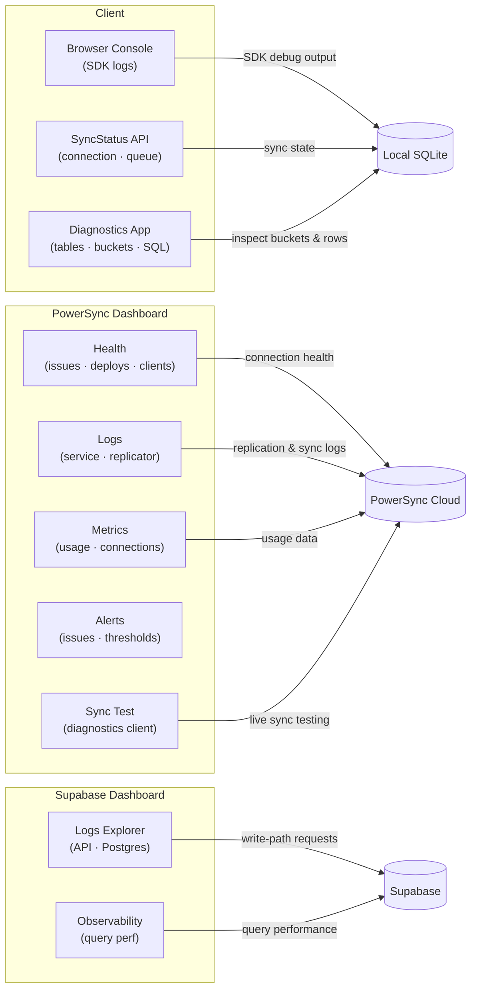
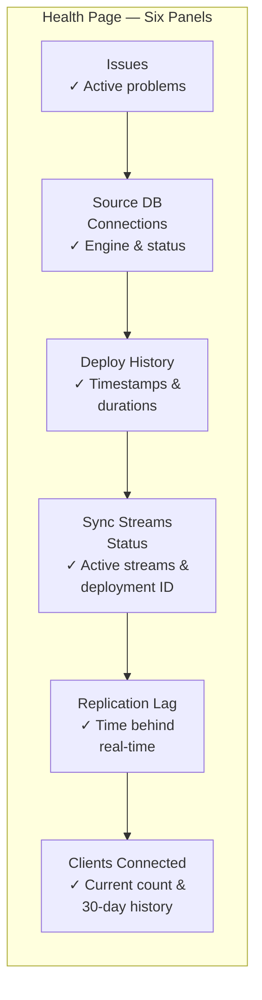
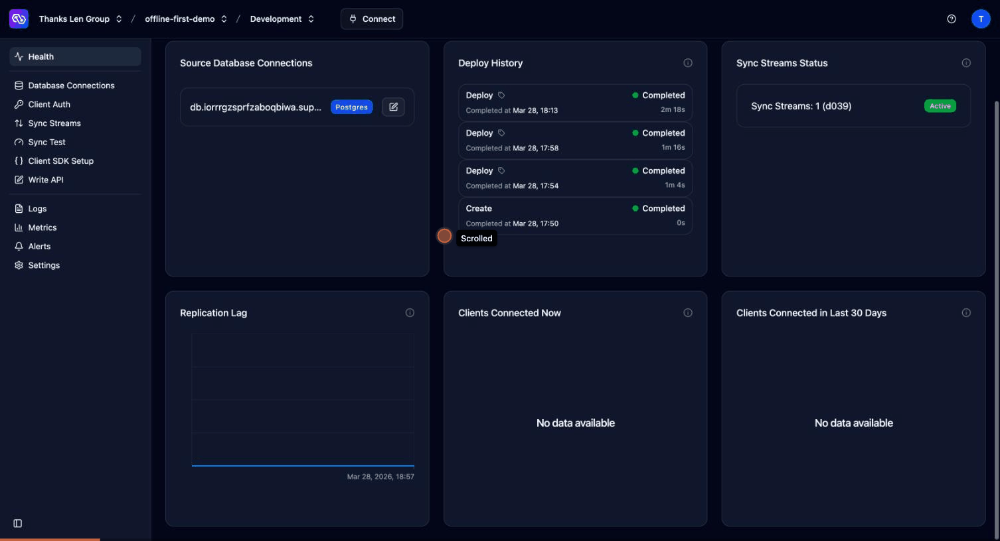
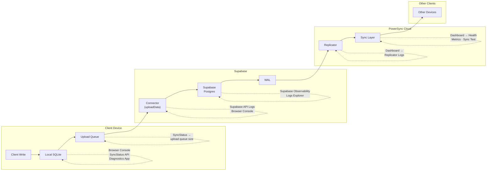
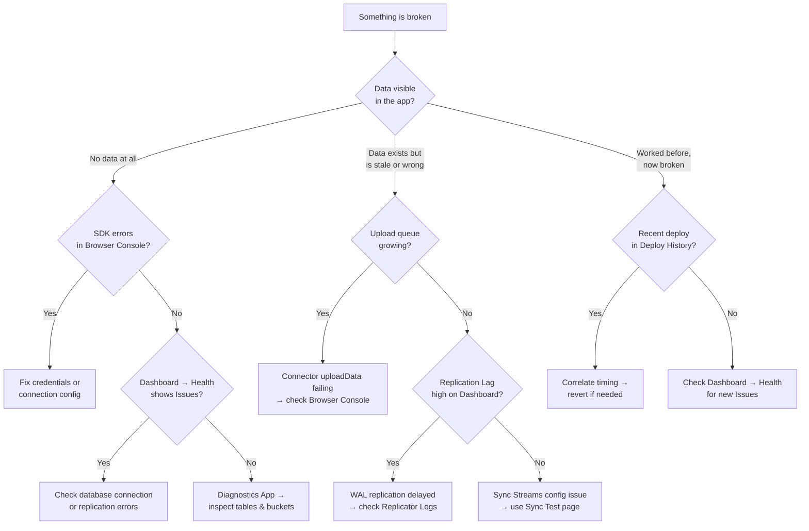

# Monitoring PowerSync

## Why monitoring is different now

With the online-first demos, every operation was a network call — you could see everything in Chrome DevTools. With PowerSync, reads and writes happen locally in SQLite. The network activity is the *sync* layer running in the background. This means you need to monitor in two places: the **client** (local database, sync status, upload queue) and the **server** (PowerSync Cloud dashboard, replication health, Sync Streams).

---

## The Monitoring Surfaces



With offline-first, monitoring now spans three systems instead of two. The PowerSync Dashboard sits in the middle — it's where you see whether the sync pipeline is healthy.

---

## PowerSync Dashboard — Health

The Health page is the first thing you see when you open your instance. It shows six panels:

- **Issues** — active problems with your instance (connection failures, replication errors). Green checkmark means all clear.
- **Source Database Connections** — which database is connected, what engine (Postgres), and a link to edit the connection.
- **Deploy History** — every deployment of Sync Streams or Client Auth changes, with timestamps and durations. Useful for correlating "sync broke at 3pm" with "we deployed at 2:58pm."
- **Sync Streams Status** — how many Sync Streams are active and their deployment ID. "Active" means the stream is processing changes from WAL.
- **Replication Lag** — how far behind the sync pipeline is from real-time. A spike here means changes in Supabase aren't reaching clients promptly.
- **Clients Connected** — how many client devices are currently syncing, plus a 30-day history.



For our demo, the important ones are **Issues** (should be green) and **Sync Streams Status** (should show "Active").

Here's a walkthrough of the dashboard pages — Health, Logs, Sync Streams, and Metrics:



---

## PowerSync Dashboard — Logs

Navigate to **Logs** in the sidebar. Two log types:

**Service/API logs** — sync activity between PowerSync and connected clients. When a client connects, syncs, or uploads changes, it appears here. These logs show:
- Client connections and disconnections
- Sync checkpoint records (how many buckets, how many rows)
- Errors during sync

**Replicator logs** — replication activity from Supabase to PowerSync. When a row changes in the `notes` table, the WAL event flows through the replicator. These logs show:
- WAL events received
- Rows replicated
- Replication errors or lag

Log retention depends on your plan (24 hours on Free, up to 30 days on Enterprise). You can filter by severity and date range, and tail logs in real-time.

---

## PowerSync Dashboard — Metrics

The Metrics page shows usage data for your instance:

- **Storage size** — how much data is stored in PowerSync's sync layer
- **Concurrent connections** — peak and average client connections
- **Data synced** — volume of data pushed to clients
- **Operations** — number of sync operations processed

For our demo with a handful of notes and one client, these will all be near zero. Metrics become meaningful when you have multiple users syncing simultaneously.

---

## PowerSync Dashboard — Alerts

Alerts notify you when something goes wrong or when usage crosses a threshold.

**Issue alerts** (all plans):
- Database connection failures
- Replication problems
- Configurable severity (Warning, Fatal)

**Usage alerts** (Team/Enterprise plans):
- Triggered when metrics exceed thresholds (data synced, connections, storage)
- Configurable aggregation window and method

Notifications go to email (all plans) or webhooks (Pro+).

---

## Client-Side Monitoring

### SDK Logging

PowerSync's Web SDK has a built-in logger. In our demo's `index.js`, you can enable it:

```js
import { createBaseLogger } from '@powersync/web'

const logger = createBaseLogger()
logger.useDefaults() // Outputs to browser console
```

This prints detailed sync activity to the browser console — connection status, sync progress, upload queue processing, and errors. The `debugMode` flag on the database adds SQL query timing to Chrome's Performance timeline.

### SyncStatus API

The SDK provides a `SyncStatus` object with:
- **Connected** — whether the client is currently connected to PowerSync Cloud
- **Last sync time** — when the last successful sync completed
- **Upload queue size** — how many local writes are waiting to be uploaded

This is how you'd build a sync indicator in the UI (like the "Live" badge in the online-sync demo, but for offline-first).

### Diagnostics App

PowerSync provides a standalone web app for inspecting sync state at [diagnostics-app.powersync.com](https://diagnostics-app.powersync.com). It asks for two inputs:

- **PowerSync Token** — a development token (JWT). Generate one from the PowerSync Dashboard: click **Connect** in the top nav → "Generate a Development Token." For our project, this is the `VITE_POWERSYNC_DEV_TOKEN` value in `powersync-demo/.env`.
- **PowerSync Endpoint** — your instance URL. Same location: **Connect** → "Instance URL." For our project: `https://69c814d3a112d86b205447a1.powersync.journeyapps.com` (also `VITE_POWERSYNC_URL` in `.env`).

The endpoint is the PowerSync **server**, not a specific client — it's the same URL for every client connecting to this instance. Clients are identified by the **`sub` (subject) claim** inside the JWT token. When you generated the dev token, you entered "offline-first-powersync" as the subject — that's the user identity PowerSync sees. In a real app with Supabase Auth, each user gets a unique JWT with their `user_id` as the subject, so PowerSync can distinguish users and filter data per-user via Sync Streams. For our demo with no auth, every client shares the same token and identity.

The diagnostics app connects as that token's user and shows what their local database looks like after sync.

What you can do with it:

- **View database statistics** — total tables, rows, and storage used in the local SQLite
- **Inspect tables and rows** — browse the actual data that sync delivered to the client, row by row
- **Inspect buckets** — PowerSync groups synced data into "buckets" (one per Sync Stream parameter combination). The diagnostics app shows how many buckets exist, what's in each one, and how large they are. This matters because PowerSync has a default limit of 1,000 buckets per user — exceeding it breaks sync.
- **Run SQL queries** — a built-in SQL console lets you query the local SQLite directly, just like you would with the `db.getAll()` calls in your app code

**When to use it:** You suspect sync delivered wrong data, missing data, or duplicate data. The diagnostics app lets you see exactly what arrived — separate from your app's UI rendering, which might be filtering or transforming the data.

**Limitation:** If a user has exceeded the bucket limit, the diagnostics app can't load for that user — sync fails before any data is retrieved. In that case, you need to diagnose via the PowerSync Dashboard instance logs instead.

---

## The Sync Test Page

The **Sync Test** page in the PowerSync Dashboard is the server-side complement to the Diagnostics App. While the Diagnostics App shows what a client *received*, Sync Test shows what the server *would send*.

To use it:

1. Navigate to **Sync Test** in the sidebar
2. Generate a development token (or use an existing one)
3. Click **Launch** to open the Sync Diagnostics Client connected to your instance

This lets you validate your Sync Streams configuration before building a client. You can see which tables and rows would sync for a given token subject (user identity) — catching configuration mistakes early. For example, if your Sync Streams query has a `WHERE owner_id = auth.user_id()` filter, Sync Test shows exactly which rows match for a specific user.

For our demo (which uses `auto_subscribe: true` with no user filtering), Sync Test should show all rows from the `notes` table going to every user — confirming the Sync Streams config is correct.

---

## Supabase Still Matters

PowerSync doesn't replace Supabase monitoring — it adds a layer on top. The write path still goes through Supabase:

1. Client writes to local SQLite
2. PowerSync SDK uploads the write to Supabase (via the connector)
3. Supabase processes the write
4. The change appears in the WAL
5. PowerSync replicates it to other clients



If a write fails at step 3, you'll see the error in **Supabase API logs**, not PowerSync logs. So both dashboards remain relevant:

- **PowerSync Dashboard** — sync health, replication, client connections
- **Supabase Dashboard** — write-path errors, query performance, schema issues

---

## When to Use Each Tool



### "Something is broken" — start here

| Symptom | Tool | What to check |
|---------|------|---------------|
| App loads but shows no data | Browser Console | Look for SDK connection errors or credential failures |
| Notes I added aren't appearing on another device | Dashboard → Logs → Replicator | Check for WAL replication errors — the change may not have left Supabase yet |
| Notes appear locally but never reach Supabase | SDK → SyncStatus → upload queue | If the queue keeps growing, the connector's `uploadData` is failing — check browser console for the error |
| Sync was working, now it's not | Dashboard → Health → Issues | Check for database connection failures or replication problems |
| Everything broke after a config change | Dashboard → Health → Deploy History | Correlate the failure time with deploy timestamps — revert if needed |

### "I want to verify things are working" — proactive checks

| Question | Tool | What you'll see |
|----------|------|-----------------|
| Is the full pipeline healthy? | Dashboard → Health | Green checkmark under Issues, "Active" under Sync Streams Status, low Replication Lag |
| Are clients connecting? | Dashboard → Health → Clients Connected | Count of currently connected devices, plus 30-day trend |
| Is sync keeping up with changes? | Dashboard → Health → Replication Lag | Time gap between a Supabase write and PowerSync processing it — should be seconds, not minutes |
| Did my Sync Streams deploy correctly? | Dashboard → Sync Streams | Shows deployed config with deployment ID and "Active" status |
| Will the right data sync for a user? | Dashboard → Sync Test | Launch the Diagnostics Client to preview which rows match the Sync Streams queries |

### "I need to debug the data" — inspecting what's actually there

| Question | Tool | What you'll see |
|----------|------|-----------------|
| What rows are in the local SQLite? | Diagnostics App → Tables | Row-by-row view of every synced table on the client |
| Does the local data match Supabase? | Diagnostics App SQL console + Supabase Table Editor | Run the same query in both — compare results side by side |
| How many buckets does a user have? | Diagnostics App → Buckets | Bucket count and contents — important because exceeding 1,000 breaks sync |
| What SQL is the SDK running? | Browser Console (with `debugMode`) | SQL queries with timing on Chrome's Performance timeline |
| Did a write actually reach the database? | Supabase → API Logs | Shows the POST request and response — 201 means it landed, 4xx/5xx means it didn't |

### "I'm planning for scale" — capacity monitoring

| Question | Tool | What you'll see |
|----------|------|-----------------|
| How much data is being synced? | Dashboard → Metrics | Volume of data pushed to clients over time |
| How many concurrent connections? | Dashboard → Metrics | Peak and average client connections — relevant for plan limits |
| Are queries getting slow? | Supabase → Observability → Query Performance | Slowest queries ranked by total impact — sync writes go through Supabase's Postgres |
| Should I set up alerts? | Dashboard → Alerts | Configure email/webhook notifications for connection failures or usage thresholds |
