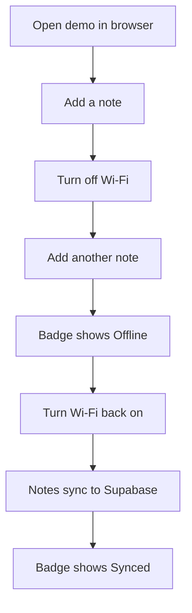
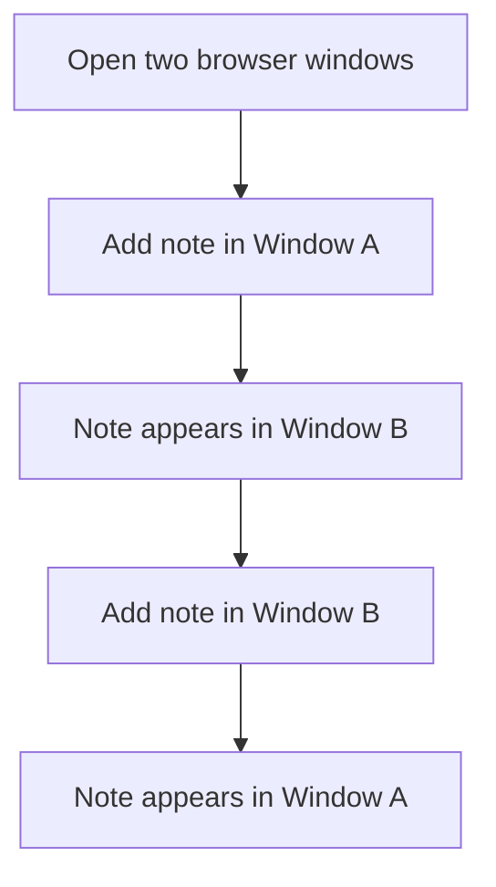

# How to Set Up and Test the PowerSync Demo

This guide walks through connecting the PowerSync demo to Supabase via PowerSync Cloud, then testing offline and multi-client sync. For the architectural concepts behind this setup, see [Offline-First with PowerSync](../explanation/04-offline-first-powersync.md).

## Setup sequence


## 1. Configure Supabase for replication

Run these SQL statements in the Supabase SQL Editor:

```sql
-- A dedicated database role for PowerSync to connect with
CREATE ROLE powersync_role WITH REPLICATION LOGIN PASSWORD 'your-password-here';

-- Read access so PowerSync can see the data
GRANT SELECT ON ALL TABLES IN SCHEMA public TO powersync_role;
ALTER DEFAULT PRIVILEGES IN SCHEMA public
  GRANT SELECT ON TABLES TO powersync_role;

-- A publication that tells Postgres which tables to replicate
CREATE PUBLICATION powersync FOR TABLE public.notes;
```

## 2. Create a PowerSync Cloud account

1. Go to [powersync.com](https://www.powersync.com) and sign up for a free account
2. Create a new project

## 3. Create a PowerSync instance

1. In your project, click "Add Instance" and choose Development
2. Select a cloud region close to your Supabase project (check your Supabase dashboard for the region)

## 4. Connect to Supabase

1. In your Supabase Dashboard, go to **Settings > Database > Connection string** and copy the **direct** connection string (not the pooled one -- WAL replication requires a direct connection)
2. In the PowerSync Dashboard, go to **Database Connections > Connect to Source Database**
3. Paste the connection URI
4. Replace the username with `powersync_role` and the password from step 1
5. Click **Test Connection**, then **Save**

## 5. Configure Sync Streams

1. In the PowerSync Dashboard, go to **Sync Streams**
2. Replace the contents with:

```yaml
config:
  edition: 3

streams:
  all_notes:
    auto_subscribe: true
    query: SELECT * FROM notes
```

3. Click **Validate** to check against your database, then **Deploy**

## 6. Note your PowerSync instance URL

1. In the PowerSync Dashboard, click **Connect** to see your instance URL
2. It looks like: `https://your-instance.powersync.journeyapps.com`

## 7. Configure the environment file

1. Copy `.env.example` to `.env`
2. Fill in the PowerSync instance URL and your Supabase credentials

## 8. Run the demo

```bash
npm install
npm run dev
```

## Testing

### Test offline mode



1. Open the demo in your browser
2. Add a note -- it appears instantly
3. Turn off Wi-Fi
4. Add another note -- it still appears instantly (stored in local SQLite)
5. The sync badge changes to "Offline"
6. Turn Wi-Fi back on
7. The queued note syncs to Supabase and the badge returns to "Synced"

### Test multi-client sync



1. Open the demo in two separate browser windows (or tabs)
2. Add a note in one window
3. The note appears in the other window within seconds
4. Use the PowerSync Diagnostics App to inspect sync state if needed

### Conflict behavior

In the current version, creating the same note in two clients while offline produces duplicate rows (each client generates a unique ID). Both rows sync and appear in both clients. Update-level conflict resolution is coming in a future version.
