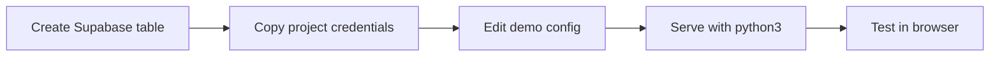
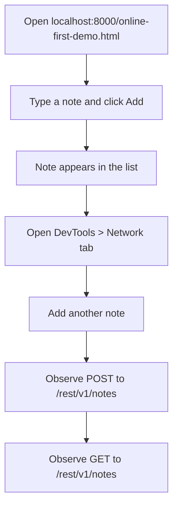

# How to Set Up and Test the Online-First Demo

This guide walks through creating the Supabase table, configuring the demo, serving it locally, and verifying it works. For the architectural concepts behind this setup, see [Why Online-First Works -- and Why It's Not Enough](../explanation/01-online-first-supabase.md).

## Setup sequence



## 1. Create the notes table in Supabase

Run this SQL in the Supabase SQL Editor (**SQL Editor > New Query**):

```sql
CREATE TABLE notes (
  id         BIGINT GENERATED ALWAYS AS IDENTITY PRIMARY KEY,
  content    TEXT NOT NULL,
  created_at TIMESTAMPTZ DEFAULT now()
);

-- Disable RLS for this learning demo (not for production)
ALTER TABLE notes ENABLE ROW LEVEL SECURITY;
CREATE POLICY "Allow all access" ON notes FOR ALL USING (true) WITH CHECK (true);
```

## 2. Get your Supabase project credentials

1. In the Supabase Dashboard, go to **Settings > API**
2. Copy the **Project URL** (looks like `https://abcdefg.supabase.co`)
3. Copy the **anon / public** key (the publishable key)

## 3. Configure the demo

Open `online-first-demo.html` and replace the two constants at the top of the script:

```js
const SUPABASE_URL  = 'https://your-project.supabase.co'
const SUPABASE_KEY  = 'your-publishable-key-here'
```

## 4. Serve the demo locally

The Supabase JS client is loaded via CDN, so the file must be served over HTTP (not opened as a `file://` URL). Start a local server from the project root:

```bash
python3 -m http.server 8000
```

## 5. Test the demo



1. Open `http://localhost:8000/online-first-demo.html` in your browser
2. Type a note in the input field and click **Add**
3. The note appears in the list below the input
4. Open **DevTools > Network** tab
5. Add another note and observe two requests:
   - A `POST` to `/rest/v1/notes` (the insert)
   - A `GET` to `/rest/v1/notes` (the reload)
6. Check the Supabase Dashboard **Table Editor** to confirm the rows exist in the `notes` table

## Troubleshooting

| Symptom | Likely cause |
|---|---|
| "Error loading notes" on page load | Wrong `SUPABASE_URL` or `SUPABASE_KEY` |
| CORS error in DevTools console | File opened as `file://` instead of served via HTTP |
| Notes save but don't appear | Check the `created_at` column exists; `loadNotes()` orders by it |
