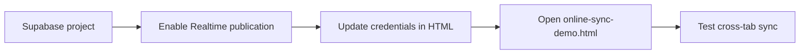
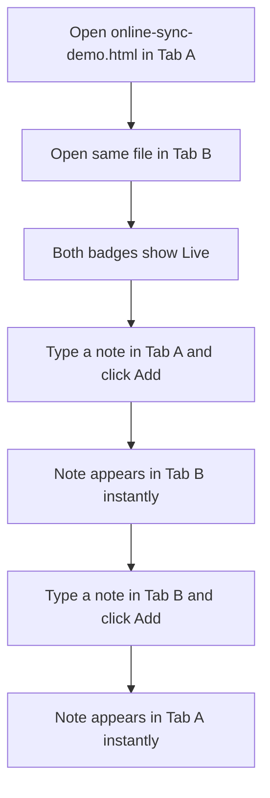
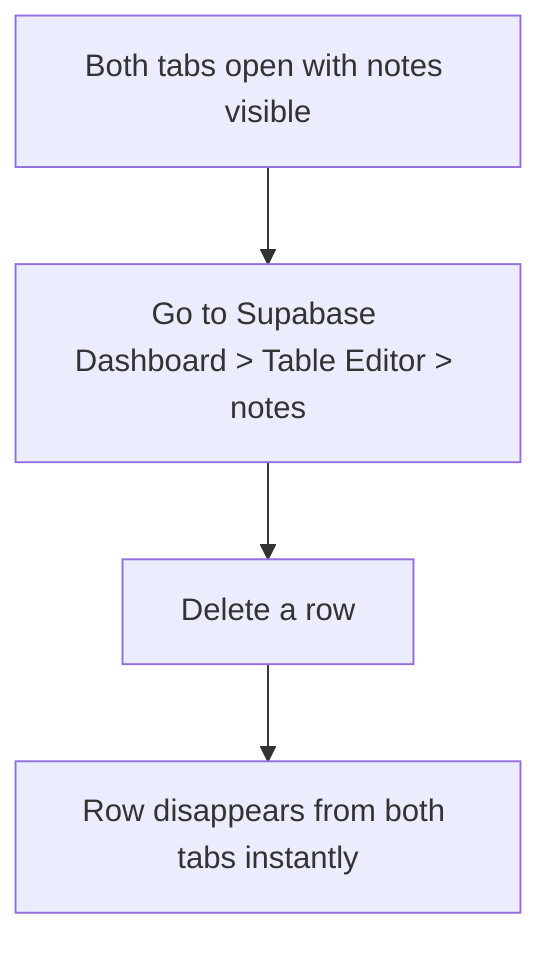

# How to Set Up and Test the Online Sync Demo

This guide walks through enabling Supabase Realtime for the `notes` table and running the online sync demo to verify live cross-tab updates. For the architectural concepts behind Realtime sync, see [Realtime Sync with Supabase](../explanation/03-realtime-sync-supabase.md).

## Setup sequence



## 1. Enable Realtime publication for the notes table

Supabase does not stream changes from all tables by default. Add the `notes` table to the `supabase_realtime` publication with a single SQL statement.

Run this via the Supabase SQL Editor, the Supabase CLI, or the Supabase MCP `execute_sql` tool:

```sql
alter publication supabase_realtime add table public.notes;
```

Via the CLI:

```bash
supabase link --project-ref <your-project-ref>
supabase db query "alter publication supabase_realtime add table public.notes;" --linked
```

To verify:

```sql
select * from pg_publication_tables where pubname = 'supabase_realtime';
```

The `notes` table should appear in the results.

## 2. Configure the demo

Open `online-sync-demo.html` and replace the placeholder values with your Supabase project credentials:

```javascript
const SUPABASE_URL  = 'https://<your-project-ref>.supabase.co'
const SUPABASE_KEY  = '<your-publishable-anon-key>'
```

Both values are available in the Supabase Dashboard under **Settings > API**.

## 3. Run the demo

Open `online-sync-demo.html` directly in a browser (no build step required). The live badge in the header changes to "Live" with a green background once the WebSocket connection is established.

## Testing

### Test live sync across tabs



1. Open `online-sync-demo.html` in two separate browser tabs, side by side
2. Confirm both tabs show the green "Live" badge
3. In Tab A, type a note and click **Add**
4. The note appears in Tab B without any refresh
5. In Tab B, type a different note and click **Add**
6. The note appears in Tab A without any refresh

### Test delete sync via dashboard



1. With both tabs open, go to the Supabase Dashboard **Table Editor** and open the `notes` table
2. Delete a row
3. The row disappears from both browser tabs immediately

### Test disconnection behavior

1. Open the demo in one tab
2. Disconnect from the network (turn off Wi-Fi or use browser DevTools to go offline)
3. The badge changes from "Live" to a disconnected state
4. Try adding a note -- the insert fails silently (no local persistence)
5. Reconnect to the network
6. Refresh the page to restore the full note list and re-establish the WebSocket
