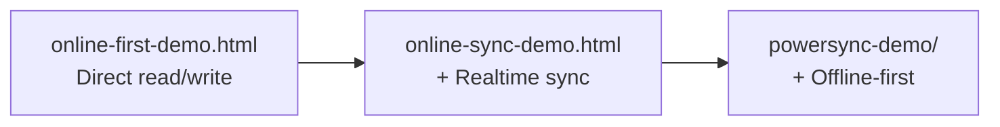

# Architecture Decisions

This document explains the "why" behind the key design choices in the offline-first project. Each decision was made to keep the project focused on teaching data synchronization patterns with minimal incidental complexity.

## Why Vanilla JS (No React, Vue, or Other Frameworks)

The project exists to teach offline-first data access patterns -- how reads, writes, sync, and conflict handling work at the protocol level. A UI framework would introduce its own state management, lifecycle hooks, and rendering abstractions that obscure the underlying data flow.

With vanilla JS, the entire data path is visible in a single file. In `online-first-demo.html`, a learner can trace the full journey from `supabase.createClient()` to `.from('notes').select('*')` to DOM update in under 120 lines. No component tree, no reactivity system, no build pipeline to understand first.

This also means zero framework-specific knowledge is required to read or modify the demos. Anyone who knows HTML and JavaScript can follow along.

## Why Docsify for Documentation

Docsify was chosen for three properties:

1. **Zero build step.** Documentation is plain Markdown files served by any static file server. There is no `npm run build`, no generated `dist/` folder, no CI pipeline for docs. Run `python3 -m http.server 8080 --directory docs` and the site is live.

2. **Plain Markdown source.** Every documentation file is readable as-is on GitHub, in any editor, and in Claude Code. The Markdown files are the source of truth -- Docsify renders them client-side using its CDN-loaded runtime.

3. **Mermaid support.** Architecture and flow diagrams are written as Mermaid code blocks in Markdown. Docsify renders them client-side via the Mermaid CDN script configured in `docs/index.html`. The diagrams are versionable, diffable, and render natively in GitHub.

The documentation site uses Docsify 4 with the `theme-simple` theme, sidebar navigation from `_sidebar.md`, full-text search, and Prism.js syntax highlighting for SQL, Bash, YAML, and JSON.

## Why Three Progressive Demos

The three demos form a deliberate learning progression, each building on the concepts introduced by the previous one:

1. **`online-first-demo.html`** establishes the baseline: a Supabase client making REST calls. Reads fetch from the server. Writes post to the server. No data exists locally. This is the simplest possible architecture and the starting point most developers know.

2. **`online-sync-demo.html`** adds one concept: Supabase Realtime. The same REST-based read/write pattern, but now a WebSocket subscription pushes INSERT and DELETE events to all connected clients. This introduces the idea that data can arrive without the user requesting it.

3. **`powersync-demo/`** inverts the model: reads and writes go to a local SQLite database. PowerSync handles bidirectional sync with Supabase in the background. This is the offline-first pattern -- the application works without a network connection.

Each step adds exactly one new concept. A learner who understands demo N has all the context needed for demo N+1.

## Why a Single Notes Table

The entire project operates on one table with three columns (`id`, `content`, `created_at`). This is intentional:

- **Eliminates relational complexity.** No foreign keys, no joins, no cascading deletes. The sync behavior is the lesson, not the data model.
- **Makes conflicts visible.** With a single flat table, sync conflicts are easy to reason about. Each note has a UUID, so two clients inserting the same text create two rows -- the simplest possible conflict-free outcome.
- **Keeps demos short.** Every demo file fits on a single screen because the data access code is minimal. Fewer lines means less cognitive load when learning.

## Why No Authentication

None of the three demos implement user authentication. The Supabase table has no Row Level Security (RLS) policies, and the PowerSync demo uses a development token instead of Supabase Auth JWTs.

This decision removes an entire layer of complexity that is orthogonal to the sync patterns being taught:

- No login/signup UI
- No token refresh logic
- No RLS policy debugging
- No session management

The tradeoff is that the demos are not production-ready as-is. Authentication and RLS are critical for any real deployment, but they are a separate concern that would obscure the data synchronization concepts this project exists to teach.

## Why Vite Only for the PowerSync Demo

The two online demos (`online-first-demo.html` and `online-sync-demo.html`) are single HTML files that load the Supabase JS client from CDN. No build tool is needed.

The PowerSync demo requires Vite because the `@powersync/web` SDK depends on:

- **WebAssembly (WASM):** The local SQLite engine (`@journeyapps/wa-sqlite`) runs as a WASM module that must be served with correct MIME types and CORS headers.
- **Web Workers:** PowerSync runs its sync engine in a web worker for non-blocking operation. Vite handles worker bundling and the `worker.format: 'es'` configuration.
- **ES module imports:** The PowerSync SDK uses ES module `import` statements that require a bundler to resolve `node_modules` dependencies in the browser.

Vite is configured to exclude `@powersync/web` from dependency pre-bundling (`optimizeDeps.exclude`) because the package contains WASM and worker files that break when pre-bundled. The `vite.config.js` also sets `root: 'src'` so the dev server serves from the `src/` directory, and `envDir: '..'` so Vite reads `.env` from the `powersync-demo/` root.
